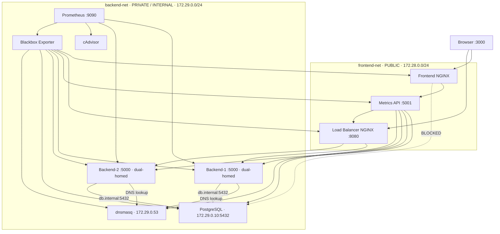

# Infra Health Dashboard

A containerized infrastructure monitoring and health-observability platform built with Docker Compose.

The project simulates a small production-style application environment with isolated networks, multiple backend instances, DNS-based service discovery, load balancing, PostgreSQL, Prometheus monitoring, automated health checks, and a React dashboard.

The goal is to demonstrate how modern DevOps and platform-engineering concepts can work together to build an **observable, resilient, and network-isolated application platform**.

---

## Problem Statement

In a distributed application environment, simply running containers is not enough.

A production-style platform needs to answer questions such as:

- Are all services healthy?
- Is traffic being distributed correctly?
- What happens when a backend instance fails?
- Can application services communicate with the database securely?
- Can the frontend directly access private infrastructure?
- Is DNS resolution working between services?
- How many requests is each backend processing?
- Can infrastructure metrics and application metrics be observed from one place?

Without proper monitoring, service discovery, traffic management, and network isolation, identifying and troubleshooting infrastructure problems becomes difficult.

**Infra Health Dashboard** was designed to simulate these requirements in a local containerized environment.

---

# Project Objective

Build a small but production-inspired infrastructure platform that demonstrates:

- Container orchestration with Docker Compose
- Network segmentation
- Service-to-service communication
- DNS-based service discovery
- Load balancing
- Application health checks
- Database connectivity
- Infrastructure monitoring
- Application-level metrics
- Failure detection
- Network isolation
- Real-time visualization

The project focuses not only on making services run, but also on making the infrastructure **observable and resilient**.

---

# Project Plan

The system was designed in layers.

### 1. Networking Layer

Create separate Docker networks for different trust boundaries.

- `frontend-net` → public-facing application layer
- `backend-net` → private internal infrastructure layer

The backend network is configured as an internal network so private services are not directly exposed to the outside environment.

---

### 2. Application Layer

Deploy two identical backend instances.

```text
backend-1
backend-2
```

Both expose:

```text
GET /health
GET /data
GET /metrics
```

The `/health` endpoint provides service health information.

The `/data` endpoint demonstrates application-to-database communication.

The `/metrics` endpoint exposes application metrics for Prometheus.

---

### 3. Database Layer

Deploy PostgreSQL as the application's persistent data store.

The database is connected only to the private backend network.

The backend services access PostgreSQL using:

```text
db.internal:5432
```

rather than relying directly on the database container name.

---

### 4. Service Discovery Layer

Deploy `dnsmasq` as a lightweight internal DNS service.

The DNS service maps:

```text
db.internal
        ↓
172.29.0.10
```

This demonstrates how applications can use stable service names instead of hard-coded infrastructure locations.

---

### 5. Load Balancing Layer

Deploy NGINX as the load balancer.

Incoming API requests are distributed between:

```text
backend-1
backend-2
```

The load balancer performs active health checking through the backend `/health` endpoints.

If a backend becomes unavailable, the health-check process removes it from the active upstream configuration.

---

### 6. Monitoring Layer

Prometheus collects both infrastructure and application-level metrics.

The monitoring stack includes:

- Prometheus
- cAdvisor
- Blackbox Exporter
- Custom Flask application metrics

This allows the platform to monitor both:

**Infrastructure**

```text
Container CPU
Container network activity
Service availability
Endpoint health
```

and **Application behaviour**

```text
HTTP request counters
Requests per backend
HTTP status codes
Request paths
```

---

### 7. Metrics API Layer

A dedicated Metrics API sits between Prometheus and the frontend.

Its responsibilities are:

1. Query Prometheus for application traffic.
2. Calculate backend request activity over the previous 60 seconds.
3. Check the health of important services.
4. Return a simplified JSON response to the frontend.

This keeps Prometheus-specific querying logic outside the React application.

---

### 8. Dashboard Layer

A React dashboard provides a visual representation of the infrastructure.

The dashboard contains three primary views:

- **Live Traffic**
- **Health Status**
- **Network Map**

This makes infrastructure behaviour easier to understand without manually inspecting individual containers or monitoring endpoints.

---

# Solution Overview

The final platform consists of multiple Docker services communicating through controlled network boundaries.

```text
                         ┌───────────────────┐
                         │      Browser      │
                         │      :3000        │
                         └─────────┬─────────┘
                                   │
                                   ▼
                         ┌───────────────────┐
                         │  Frontend NGINX   │
                         │     React UI      │
                         └─────────┬─────────┘
                                   │
                                   ▼
                         ┌───────────────────┐
                         │    Metrics API    │
                         │      :5001        │
                         └─────────┬─────────┘
                                   │
                    ┌──────────────┼──────────────┐
                    │              │              │
                    ▼              ▼              ▼
              ┌──────────┐   ┌──────────┐   ┌────────────┐
              │Backend 1 │   │Backend 2 │   │ Prometheus │
              │  :5000   │   │  :5000   │   │   :9090   │
              └────┬─────┘   └────┬─────┘   └────────────┘
                   │              │
                   └──────┬───────┘
                          │
                          ▼
                  ┌────────────────┐
                  │    dnsmasq     │
                  │ db.internal    │
                  └───────┬────────┘
                          │
                          ▼
                  ┌────────────────┐
                  │   PostgreSQL   │
                  │  172.29.0.10   │
                  └────────────────┘
```

---

# Architecture



---

# Network Architecture

The platform uses two separate Docker networks.

| Network | Type | Subnet | Purpose |
|---|---|---|---|
| `frontend-net` | Public | `172.28.0.0/24` | User-facing services |
| `backend-net` | Private / Internal | `172.29.0.0/24` | Application and infrastructure services |

The important security boundary is:

```text
Frontend
   │
   │ X
   ▼
PostgreSQL
```

The frontend does **not** have direct network access to PostgreSQL.

Backend services, however, can access PostgreSQL through:

```text
backend
   │
   ▼
db.internal
   │
   ▼
PostgreSQL
```

This demonstrates basic network segmentation and least-privilege communication between application layers.

---

# Load Balancing

NGINX distributes application traffic between two backend instances:

```text
                    ┌─────────────┐
                    │    NGINX    │
                    │ Load Balancer│
                    └──────┬──────┘
                           │
                ┌──────────┴──────────┐
                ▼                     ▼
          ┌───────────┐         ┌───────────┐
          │ Backend 1 │         │ Backend 2 │
          └───────────┘         └───────────┘
```

Both backends provide:

```text
/health
```

The load balancer continuously checks backend health.

When one backend becomes unavailable, it is removed from the active upstream configuration so traffic can continue through the healthy backend.

---

# DNS-Based Service Discovery

The platform includes a dedicated `dnsmasq` service.

Instead of coupling the application to a container IP address, backend services resolve:

```text
db.internal
```

through the internal DNS service.

```text
backend
   │
   │ DNS query
   ▼
dnsmasq
   │
   │ db.internal
   ▼
172.29.0.10
   │
   ▼
PostgreSQL
```

This demonstrates the same general principle used in larger infrastructure platforms: applications communicate using **service names**, while infrastructure manages how those names resolve.

---

# Observability

The project implements two levels of monitoring.

## Infrastructure Monitoring

cAdvisor provides container-level metrics such as:

- CPU usage
- Network activity
- Container resource information

Blackbox Exporter performs endpoint-level probing to determine whether services are reachable and responding correctly.

---

## Application Monitoring

The Flask backend exposes custom Prometheus metrics.

For example:

```text
http_requests_total
```

The metric contains labels such as:

```text
backend
method
path
status
```

This makes it possible to determine which backend is processing requests and how much traffic it is receiving.

---

# Metrics API

The Metrics API queries Prometheus using application-specific PromQL queries.

For example, the system calculates backend request activity over a rolling 60-second window.

The API also checks the health of:

```text
Frontend
Backend 1
Backend 2
Database
DNS
Load Balancer
```

The React dashboard consumes the Metrics API rather than communicating directly with Prometheus.

This creates a clean separation:

```text
Prometheus
    │
    ▼
Metrics API
    │
    ▼
React Dashboard
```

---

# Dashboard

The dashboard provides three main views.

## Live Traffic

Displays request activity for both backend instances over a rolling 60-second window.

This makes load-balancer behaviour visible in real time.

---

## Health Status

Displays the current health state of the major platform components.

```text
Frontend       ✓
Backend-1      ✓
Backend-2      ✓
Database       ✓
DNS            ✓
Load Balancer  ✓
```

---

## Network Map

Provides a visual representation of:

- Public network
- Private network
- Service relationships
- Database connectivity
- DNS resolution
- Monitoring paths
- Blocked frontend-to-database communication

---

# Failure Handling

The project also demonstrates failure scenarios.

For example, when one backend instance is stopped:

```text
Backend-1
    ↓
UNAVAILABLE
```

The monitoring system detects the failure and the load-balancing layer stops sending traffic to the unhealthy instance.

The dashboard reflects the changed health state.

After the backend is restored, it becomes available again.

This demonstrates a basic form of **service resilience and failure detection**.

---

# Technology Stack

| Technology | Purpose |
|---|---|
| Docker | Containerization |
| Docker Compose | Multi-container orchestration |
| NGINX | Web server and load balancer |
| Flask | Backend and Metrics API |
| Gunicorn | Production-style Python application server |
| PostgreSQL | Relational database |
| dnsmasq | Internal DNS / service discovery |
| Prometheus | Metrics collection and querying |
| cAdvisor | Container resource monitoring |
| Blackbox Exporter | Endpoint availability monitoring |
| React | Dashboard UI |
| Vite | Frontend build tooling |
| Recharts | Traffic visualization |
| Python | Backend, metrics and health-check logic |
| Bash | Infrastructure automation and testing |

---

# Project Structure

```text
infra-health-dashboard/
│
├── backend/
│   ├── Dockerfile
│   ├── app.py
│   └── requirements.txt
│
├── database/
│   ├── Dockerfile
│   ├── entrypoint.sh
│   ├── health.py
│   └── init.sql
│
├── dns/
│   ├── Dockerfile
│   ├── dnsmasq.conf
│   └── health.py
│
├── loadbalancer/
│   ├── Dockerfile
│   ├── healthcheck.sh
│   └── nginx.conf
│
├── metrics-api/
│   ├── Dockerfile
│   ├── app.py
│   └── requirements.txt
│
├── monitoring/
│   ├── prometheus.yml
│   └── blackbox.yml
│
├── frontend/
│   ├── Dockerfile
│   ├── nginx.conf
│   ├── package.json
│   └── src/
│
├── firewall/
│   ├── Dockerfile
│   └── entrypoint.sh
│
├── scripts/
│   ├── generate-traffic.sh
│   ├── verify.sh
│   ├── firewall-linux.sh
│   └── failure-tests.md
│
├── docs/
│   └── screenshots/
│
├── docker-compose.yml
├── README.md
└── .gitignore
```

---

# Running the Project

Clone the repository:

```bash
git clone https://github.com/dhruvabhat24/infra-health-dashboard.git
cd infra-health-dashboard
```

Build the containers:

```bash
docker compose build
```

Start the platform:

```bash
docker compose up -d
```

Check service status:

```bash
docker compose ps
```

Open the dashboard:

```text
http://localhost:3000
```

The load balancer can also be accessed directly:

```text
http://localhost:8080
```

---

# What This Project Demonstrates

This project demonstrates practical understanding of several DevOps and platform-engineering concepts:

### Containerization

Packaging application and infrastructure components as reproducible Docker containers.

### Network Segmentation

Separating public-facing and private infrastructure using Docker networks.

### Service Discovery

Using DNS-based service names instead of directly coupling applications to IP addresses.

### Load Balancing

Distributing requests across multiple backend instances.

### Health Checking

Detecting unavailable services and exposing service health to the platform.

### Observability

Collecting both infrastructure and application-level metrics.

### Failure Detection

Detecting backend failures and reflecting them in the monitoring dashboard.

### Infrastructure Visualization

Turning infrastructure state and metrics into an understandable real-time dashboard.

### Automation

Using Docker Compose, configuration files, health checks and shell scripts to automate infrastructure setup and validation.

---

# Why I Built This

The purpose of this project is to move beyond simply learning individual DevOps tools.

Instead of using Docker, NGINX, Prometheus, DNS and networking concepts independently, this project combines them into one working platform.

The focus is on understanding the relationship between:

```text
Networking
     +
Application Services
     +
Service Discovery
     +
Load Balancing
     +
Monitoring
     +
Failure Detection
     +
Visualization
```

This provides a practical foundation for understanding larger concepts used in **Cloud Engineering, DevOps, SRE and Platform Engineering**.

---


# Author

**Dhruva Bhat S N**

DevOps / Cloud & Infrastructure Engineering

GitHub: [@Dhruvabhat24](https://github.com/dhruvabhat24)

---

## License

This project is intended for learning, portfolio development, and demonstration of DevOps and infrastructure engineering concepts.
