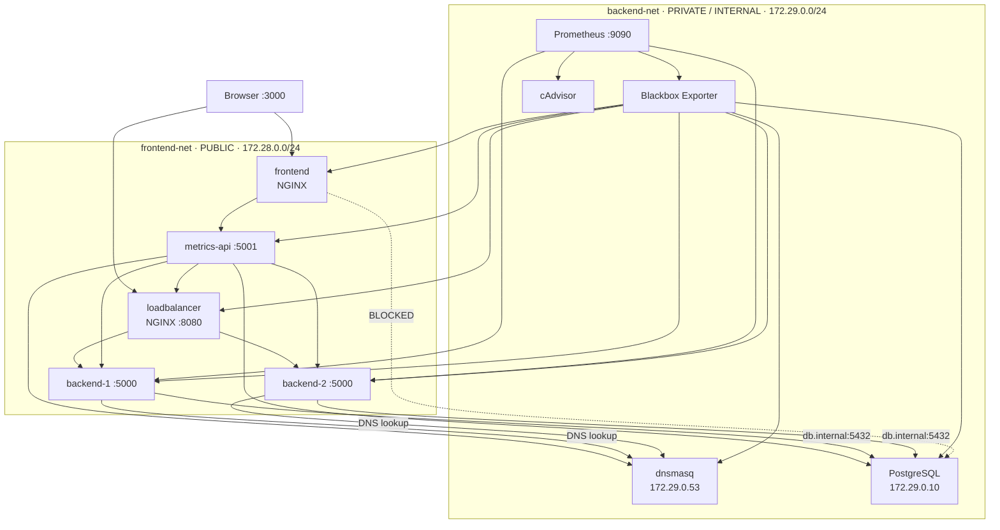

# Infra Health Dashboard

A DevOps portfolio project demonstrating Docker networking, private service-to-service communication, DNS indirection, NGINX load balancing with active health checks, Prometheus observability, and a React operational dashboard.

## What this demonstrates

- Two isolated Docker networks:
  - `frontend-net`: public application network.
  - `backend-net`: private/internal network.
- PostgreSQL is attached **only** to `backend-net`.
- Two identical Flask API replicas are dual-homed on both networks.
- Backends reach PostgreSQL through the explicit DNS name `db.internal`.
- A DNS service runs `dnsmasq` and maps `db.internal` → `172.29.0.10`.
- NGINX actively checks both backend `/health` endpoints every 2 seconds and rewrites its upstream pool.
- Prometheus collects custom backend request counters.
- cAdvisor exposes container CPU/network metrics for all containers.
- Blackbox Exporter probes HTTP health endpoints.
- `metrics-api` combines Prometheus traffic data and live health probes.
- React + Recharts renders Live Traffic, Health Status, and Network Map views.
- Failure tests demonstrate live degradation and recovery.

> **Important NGINX detail:** open-source NGINX does not include NGINX Plus-style active health checks. This project therefore uses an NGINX container plus a small active-check loop that calls each backend's `/health` endpoint and rewrites/reloads the NGINX upstream configuration. This keeps the load balancer NGINX-based while making the health-check mechanism visible and easy to explain in an interview.

---

## Architecture diagram



### Network boundaries

| Service | frontend-net | backend-net |
|---|---:|---:|
| frontend | ✓ | |
| loadbalancer | ✓ | |
| metrics-api | ✓ | ✓ |
| backend-1 | ✓ | ✓ |
| backend-2 | ✓ | ✓ |
| dns | | ✓ |
| database | | ✓ |
| prometheus | | ✓ |
| blackbox-exporter | | ✓ |
| cadvisor | | ✓ |

`backend-net` is declared `internal: true`, and the database has no interface on `frontend-net`.

---

## Project structure

```text
infra-health-dashboard/
├── docker-compose.yml
├── README.md
├── backend/
│   ├── Dockerfile
│   ├── app.py
│   └── requirements.txt
├── database/
│   ├── Dockerfile
│   ├── entrypoint.sh
│   ├── health.py
│   └── init.sql
├── dns/
│   ├── Dockerfile
│   ├── dnsmasq.conf
│   └── health.py
├── loadbalancer/
│   ├── Dockerfile
│   ├── nginx.conf
│   └── healthcheck.sh
├── metrics-api/
│   ├── Dockerfile
│   ├── app.py
│   └── requirements.txt
├── monitoring/
│   ├── blackbox.yml
│   └── prometheus.yml
├── frontend/
│   ├── Dockerfile
│   ├── nginx.conf
│   ├── package.json
│   ├── index.html
│   ├── vite.config.js
│   └── src/
│       ├── api.js
│       ├── App.jsx
│       ├── main.jsx
│       ├── styles.css
│       └── components/
│           ├── LiveTraffic.jsx
│           ├── HealthStatus.jsx
│           └── NetworkMap.jsx
├── firewall/
│   ├── Dockerfile
│   └── entrypoint.sh
└── scripts/
    ├── generate-traffic.sh
    ├── firewall-linux.sh
    └── failure-tests.md
```

---

## Prerequisites

Windows 11 with:

1. Docker Desktop
2. WSL2 integration enabled for your Linux distribution
3. Git
4. `curl` available inside WSL

Verify:

```bash
docker --version
docker compose version
curl --version
```

---

## 1. Start the stack

From WSL:

```bash
git clone <your-repository-url>
cd infra-health-dashboard
docker compose up --build -d
```

Check:

```bash
docker compose ps
```

You should see the application, monitoring, DNS, database, and backend services running.

Open:

- Dashboard: http://localhost:3000
- Load balancer: http://localhost:8080
- Metrics API: http://localhost:5001/metrics/summary
- Prometheus: http://localhost:9090
- cAdvisor: http://localhost:8081

---

## 2. Generate traffic

Run:

```bash
chmod +x scripts/generate-traffic.sh
./scripts/generate-traffic.sh
```

Leave it running while using the dashboard.

You can also make individual requests:

```bash
curl.exe http://localhost:8080/data
curl.exe http://localhost:8080/health
```

The response from `/data` identifies which backend served the request.

---

## 3. Understand the backend

Each backend exposes:

```text
GET /health
GET /data
GET /metrics
```

`/health` is deliberately cheap and does not depend on PostgreSQL.

`/data` connects to:

```text
db.internal:5432
```

The important point is that the Flask code never uses `database` as the hostname.

The backend container is explicitly configured with:

```yaml
dns:
  - 172.29.0.53
```

That means its resolver is the `dnsmasq` container.

---

## 4. Understand the explicit DNS configuration

The file `dns/dnsmasq.conf` contains:

```text
no-resolv
no-hosts
listen-address=172.29.0.53
bind-interfaces
address=/db.internal/172.29.0.10
server=1.1.1.1
```

The key line is:

```text
address=/db.internal/172.29.0.10
```

So:

```text
db.internal
    ↓
dnsmasq
    ↓
172.29.0.10
    ↓
PostgreSQL
```

This deliberately demonstrates DNS indirection instead of relying on Docker's automatic service-name discovery.

Test it:

```bash
docker compose exec backend1 getent hosts db.internal
```

Expected:

```text
172.29.0.10    db.internal
```

Then prove the database path:

```bash
curl.exe http://localhost:8080/data
```

---

## 5. Understand active load-balancer health checks

The load balancer periodically runs:

```text
GET http://backend1:5000/health
GET http://backend2:5000/health
```

every two seconds.

The script writes the healthy servers into:

```text
/etc/nginx/conf.d/upstream.conf
```

and reloads NGINX.

This means if backend-1 dies, it is removed from the active upstream set.

Watch the checker:

```bash
docker compose logs -f loadbalancer
```

You should see:

```text
backend-1=UP
backend-2=UP
```

---

## 6. Understand Prometheus

Prometheus scrapes:

### Custom application metrics

Both Flask backends expose:

```text
http_requests_total
```

with a `backend` label.

The dashboard query is:

```promql
sum by (backend) (
  increase(http_requests_total{job="backends"}[60s])
)
```

This calculates requests handled by each backend during the previous 60 seconds.

### Container metrics

cAdvisor supplies CPU, memory, filesystem and network metrics for the Docker containers.

### Health metrics

Blackbox Exporter probes the HTTP health endpoints.

---

## 7. Understand metrics-api

The endpoint:

```text
GET /metrics/summary
```

combines:

1. Prometheus traffic data.
2. Health checks for:
   - frontend
   - backend-1
   - backend-2
   - database
   - dns
   - loadbalancer

Example shape:

```json
{
  "timestamp": "2026-09-04T08:00:00+00:00",
  "traffic_last_60s": {
    "backend-1": 42,
    "backend-2": 39
  },
  "health": {
    "frontend": {"status": "ok", "http_status": 200},
    "backend-1": {"status": "ok", "http_status": 200},
    "backend-2": {"status": "ok", "http_status": 200},
    "database": {"status": "ok", "http_status": 200},
    "dns": {"status": "ok", "http_status": 200},
    "loadbalancer": {"status": "ok", "http_status": 200}
  },
  "prometheus": "ok"
}
```

---

# Dashboard views

## Live Traffic

The React component polls:

```text
/api/metrics/summary
```

every 2.5 seconds.

The chart displays the rolling 60-second request count for each backend.

### Screenshot placeholder

> **Paste screenshot here:** `docs/screenshots/live-traffic.png`

---

## Health Status

The health view polls every 3 seconds and displays six cards:

- frontend
- backend-1
- backend-2
- database
- dns
- loadbalancer

### Screenshot placeholder

> **Paste screenshot here:** `docs/screenshots/health-status.png`

---

## Network Map

The SVG view shows:

- public `frontend-net`
- private `backend-net`
- backend → database traffic
- backend → DNS resolution
- load balancer → backend traffic
- metrics-api probes
- frontend → database as a red **BLOCKED** path

### Screenshot placeholder

> **Paste screenshot here:** `docs/screenshots/network-map.png`

---

# Failure Testing

Keep the dashboard open and run the tests below from another WSL terminal.

## Test 1 — Kill backend-1

```bash
docker compose stop backend1
```

Expected:

1. `backend-1` health card becomes red.
2. NGINX active checker marks backend-1 as DOWN.
3. NGINX removes backend-1 from the upstream.
4. New traffic is handled by backend-2.
5. Live Traffic approaches 100% backend-2.

Restore:

```bash
docker compose start backend1
```

---

## Test 2 — Kill backend-2

```bash
docker compose stop backend2
```

Expected:

- backend-2 card turns red.
- Traffic shifts to backend-1.

Restore:

```bash
docker compose start backend2
```

---

## Test 3 — Break DNS

```bash
docker compose stop dns
```

Expected:

- DNS health card turns red.
- New backend `/data` database lookups using `db.internal` fail.
- Backend `/health` can remain green because that endpoint intentionally does not require the database.

Restore:

```bash
docker compose start dns
```

---

## Test 4 — Stop the database

```bash
docker compose stop database
```

Expected:

- Database card turns red.
- `/data` requests fail because PostgreSQL is unavailable.
- Backend health can remain green.

Restore:

```bash
docker compose start database
```

---

## Test 5 — Stop the load balancer

```bash
docker compose stop loadbalancer
```

Expected:

- Load balancer card turns red.
- Direct requests to `localhost:8080` fail.
- The backend containers themselves can remain healthy.

Restore:

```bash
docker compose start loadbalancer
```

---

# Firewall / network isolation test

Start the optional firewall service:

```bash
docker compose --profile firewall up -d firewall
```

View the firewall log:

```bash
docker compose --profile firewall logs firewall
```

The intended rule is:

```text
172.28.0.0/24 → 172.29.0.10 : DROP
```

Test from the frontend container:

```bash
docker compose exec frontend sh -c   'wget -T 2 -O - http://172.29.0.10:5432 || true'
```

The request should fail.

The stronger architectural control is that the database is not connected to `frontend-net` at all and `backend-net` is declared internal.

On a native Linux Docker host, the equivalent host-level rule can be installed in the Docker `DOCKER-USER` chain:

```bash
sudo iptables -I DOCKER-USER 1   -s 172.28.0.0/24   -d 172.29.0.10   -j DROP
```

Verify:

```bash
sudo iptables -L DOCKER-USER -n --line-numbers
```

> Docker Desktop on Windows runs its Linux containers inside a managed Linux environment, so host-level iptables behavior is different from a native Linux Docker host. This project therefore treats Docker network isolation as the deterministic security boundary and the iptables component as defense-in-depth.

---

# What to explain in an interview

### Why two networks?

The public application tier does not need direct access to the database. Keeping PostgreSQL on a private network reduces the reachable attack surface.

### Why two backend replicas?

They demonstrate horizontal scaling and allow the load balancer to fail over when one instance disappears.

### Why custom DNS?

It demonstrates that application configuration can be decoupled from Docker service names. `db.internal` is an application-level DNS contract.

### Why health checks separate from traffic?

A cheap `/health` endpoint allows the load balancer to determine whether a backend should receive traffic without requiring a database query for every health check.

### Why Prometheus + cAdvisor?

Prometheus handles time-series collection, while cAdvisor exposes container-level resource/network metrics.

### Why metrics-api?

The React UI should not need to understand PromQL or know where every internal service lives. `metrics-api` acts as a small aggregation layer.

### Why active checks instead of passive NGINX checks?

Passive checks only discover a failure when traffic hits a failed upstream. The active checker continuously calls `/health`, so a failed backend can be removed before the next user request.

---

# Useful commands

```bash
# Stack status
docker compose ps

# Logs
docker compose logs -f backend1 backend2 loadbalancer metrics-api

# Inspect networks
docker network inspect frontend-net
docker network inspect backend-net

# Check backend DNS
docker compose exec backend1 getent hosts db.internal

# Backend data
curl.exe http://localhost:8080/data

# Metrics summary
curl.exe http://localhost:5001/metrics/summary

# Prometheus
curl.exe http://localhost:9090/-/healthy

# Stop everything
docker compose down

# Stop everything and delete persistent volumes
docker compose down -v
```

---

# Portfolio talking points

This project is intentionally small enough to run on a laptop but demonstrates several production-oriented concepts:

**Networking**
→ network segmentation  
→ private database  
→ explicit DNS  
→ firewall defense-in-depth  

**Reliability**
→ two replicas  
→ active health checks  
→ automatic removal of unhealthy instances  

**Observability**
→ Prometheus  
→ cAdvisor  
→ Blackbox Exporter  
→ custom application counters  
→ aggregated metrics API  

**Application**
→ React  
→ Recharts  
→ live polling  
→ operational health dashboard  

**DevOps**
→ Dockerfiles  
→ Docker Compose  
→ repeatable local environment  
→ failure injection  
→ observable recovery  

---

# Future improvements

For a production/cloud version, consider:

- Kubernetes Deployments and Services
- Ingress
- Kubernetes NetworkPolicies
- External DNS
- Prometheus Operator
- Grafana dashboards
- Alertmanager
- OpenTelemetry traces
- Terraform infrastructure
- GitHub Actions CI/CD
- image scanning with Trivy
- non-root containers
- secrets management
- HTTPS/TLS
