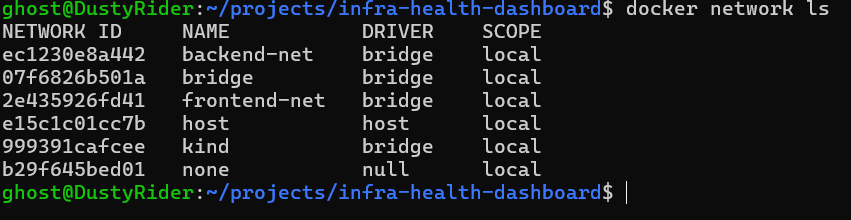

# Test 02 — Docker Network Topology

## 1. What Is This Test?

The Docker Network Topology test verifies that the Docker environment contains the two dedicated networks used by the Infra Health Dashboard:

- `frontend-net` — public-facing network
- `backend-net` — private/internal network

The project uses network segmentation to separate frontend-facing components from private infrastructure such as PostgreSQL and DNS.

This test is the first validation of that network design.

---

## 2. Why Does This Matter?

Network segmentation is an important infrastructure and security practice.

Instead of placing every container on a single shared Docker network, the project separates services according to their communication requirements.

The intended architecture is:

- `frontend-net` provides connectivity for frontend-facing services.
- `backend-net` provides private connectivity for backend and infrastructure services.
- Backend services are dual-homed so they can communicate across the two network layers where required.
- PostgreSQL is isolated from the public-facing network.

This reduces unnecessary network exposure and provides a clear security boundary between application-facing and private infrastructure components.

---

## 3. Test Objective

The objective of this test is to verify that the two application-specific Docker networks required by the architecture have been created successfully.

The expected networks are:

| Network | Purpose | Subnet |
|---|---|---|
| `frontend-net` | Public/application-facing network | `172.28.0.0/24` |
| `backend-net` | Private/internal network | `172.29.0.0/24` |

This test specifically validates **network existence**.

The attachment of individual containers to each network will be validated in the next stage of the network testing process.

---

## 4. Test Environment

The test is performed locally using:

- Windows 11
- WSL2
- Docker Desktop
- Docker Compose
- Docker Engine

Project:

**Infra Health Dashboard**

---

## 5. Steps to Conduct the Test

Navigate to the project directory:

    cd ~/projects/infra-health-dashboard

List all Docker networks:

    docker network ls

Review the output and locate:

    backend-net

and:

    frontend-net

The command also displays the network driver and scope.

---

## 6. Expected Result

The test passes when both project networks appear in the Docker network list:

    backend-net
    frontend-net

Both networks should use the:

    bridge

driver.

They should also have:

    local

scope.

The expected Docker network architecture is:

    frontend-net
        172.28.0.0/24

    backend-net
        172.29.0.0/24

The exact network IDs are generated by Docker and may differ between deployments.

---

## 7. Test Evidence

The following screenshot shows the Docker network list generated using `docker network ls`.

---

## 8. Actual Test Output

The `docker network ls` command was executed from the project directory.

The output showed both required application networks:

- `backend-net`
- `frontend-net`

Both networks were listed with the `bridge` driver and `local` scope.

The output also contained Docker's default networks, including `bridge`, `host`, and `none`. These are standard Docker networks and are not part of the Infra Health Dashboard architecture.

---

## 9. Output Explanation

### `backend-net`

The output contains:

    backend-net    bridge    local

This confirms that the private network required by the backend infrastructure exists in the Docker environment.

This network is used by private services such as PostgreSQL and DNS, as well as services that require access to the backend infrastructure.

---

### `frontend-net`

The output contains:

    frontend-net    bridge    local

This confirms that the public/application-facing network required by the dashboard architecture exists.

It provides the network layer used by frontend-facing services such as the frontend and load balancer.

---

### `bridge`

The standard Docker `bridge` network is also present.

This is a default Docker network and is separate from the custom networks created specifically for this project.

Its presence is therefore expected and does not indicate a problem.

---

### `host`

The standard Docker `host` network is present as well.

This is another default Docker network and is not used as the application's primary network segmentation mechanism.

---

### `none`

The `none` network is also a standard Docker network.

It provides containers with no network connectivity and is unrelated to the project's application networks.

---

## 10. Test Result

### PASS

The Docker network existence test successfully passed.

Both application-specific networks required by the Infra Health Dashboard are present:

- `backend-net`
- `frontend-net`

Both use the expected Docker `bridge` driver and local scope.

This confirms that the basic network foundation required by the project has been created successfully.

---

## 11. DevOps Relevance

This test demonstrates the importance of validating infrastructure configuration against the intended architecture.

In a real DevOps environment, network configuration can be validated through:

- Docker network inspection
- Kubernetes NetworkPolicies
- VPC/subnet validation
- Infrastructure-as-Code validation
- CI/CD smoke tests
- Automated security checks

Creating separate network layers also follows the principle of **least network exposure**: services should only be connected to networks required for their function.

---

## 12. Next Test

The next network test will inspect the actual container membership of `frontend-net` and `backend-net`.

That test will verify that each service is attached to the correct network and that PostgreSQL is isolated from the frontend network.
