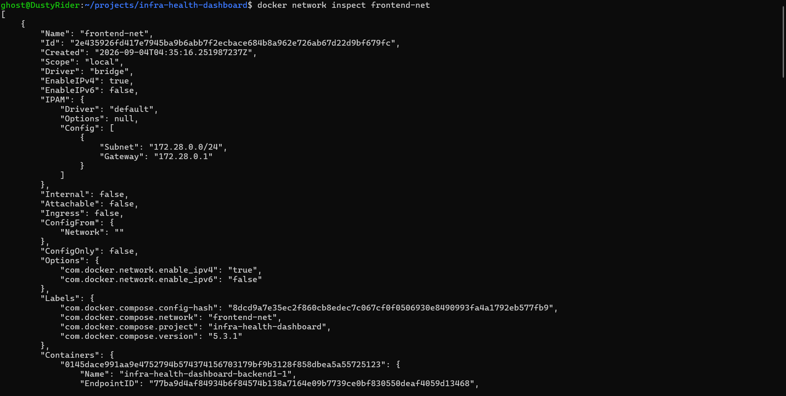
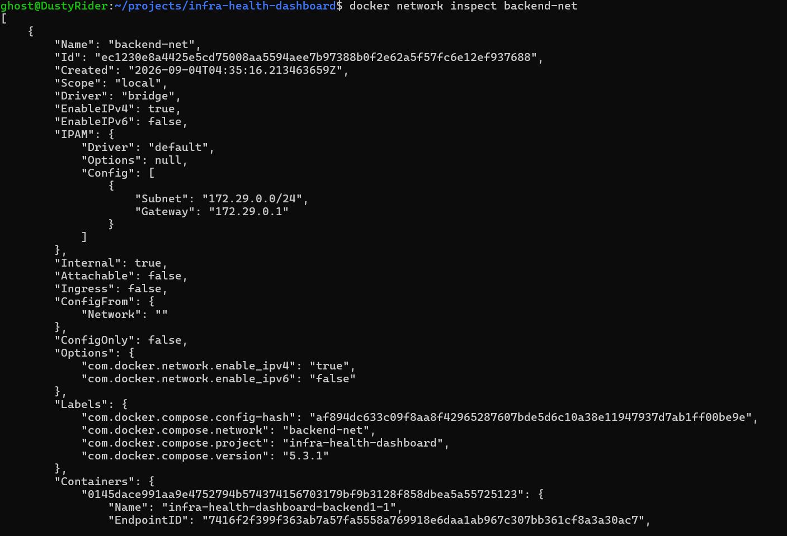

# Test 03 — Container Network Membership

## 1. What Is This Test?

The Container Network Membership test verifies that Docker containers are attached to the intended application networks.

The Infra Health Dashboard uses two separate network layers:

- `frontend-net` — public/application-facing network
- `backend-net` — private/internal network

Some services are intentionally connected to both networks. These are known as **dual-homed services**.

The intended topology is:

| Service | `frontend-net` | `backend-net` |
|---|---:|---:|
| Frontend | ✅ | ❌ |
| Load Balancer | ✅ | ❌ |
| Backend 1 | ✅ | ✅ |
| Backend 2 | ✅ | ✅ |
| Metrics API | ✅ | ✅ |
| Database | ❌ | ✅ |
| DNS | ❌ | ✅ |
| Prometheus | ❌ | ✅ |
| Blackbox Exporter | ✅ | ✅ |
| cAdvisor | ❌ | ✅ |

The purpose of this test is to validate the actual Docker network attachments rather than relying only on the Docker Compose configuration.

---

## 2. Why Does This Matter?

Creating a network does not automatically prove that services are attached to it correctly.

Incorrect network membership can create two major problems:

1. **Connectivity failures** — a service may not be able to reach a dependency it requires.
2. **Unnecessary exposure** — a private service may accidentally become reachable from a public-facing network.

For example, PostgreSQL should only exist on `backend-net`. It should not have a network interface on `frontend-net`.

The backend services are intentionally dual-homed because they need to communicate with both the application-facing and private network layers.

This test therefore validates an important infrastructure security principle:

> **Services should only be connected to networks required for their function.**

---

## 3. Test Objective

The objective is to inspect both Docker networks and verify their container membership.

We specifically want to confirm:

- `frontend-net` uses the expected `172.28.0.0/24` subnet.
- `backend-net` uses the expected `172.29.0.0/24` subnet.
- The networks have the expected `bridge` driver.
- `backend-net` is configured as an internal network.
- Backend services can participate in both network layers.
- Public-facing services are not unnecessarily attached to the private network.
- PostgreSQL is isolated from `frontend-net`.

---

## 4. Test Environment

The test is performed locally using:

- Windows 11
- WSL2
- Docker Desktop
- Docker Engine
- Docker Compose

Project:

**Infra Health Dashboard**

---

## 5. Steps to Conduct the Test

Navigate to the project directory:

    cd ~/projects/infra-health-dashboard

Inspect the public network:

    docker network inspect frontend-net

Inspect the private network:

    docker network inspect backend-net

The `docker network inspect` command displays the network configuration and the containers currently attached to the network.

The most important section for this test is:

    "Containers"

This section contains the containers connected to each Docker network.

---

## 6. Expected Result

### `frontend-net`

The expected application-facing members include:

- Frontend
- Load Balancer
- Backend 1
- Backend 2
- Metrics API

### `backend-net`

The expected private-network members include:

- Backend 1
- Backend 2
- Metrics API
- Database
- DNS
- Prometheus
- Blackbox Exporter
- cAdvisor

The most important isolation requirements are:

- PostgreSQL must not be connected to `frontend-net`.
- Frontend must not be connected to `backend-net`.

---

## 7. Test Evidence

### Frontend Network Inspection

The following screenshot shows the inspection of `frontend-net`.

**Screenshot filename:** `03-frontend-net.png`

**Upload location:** `docs/screenshots/03-frontend-net.png`

---

### Backend Network Inspection

The following screenshot shows the inspection of `backend-net`.

**Screenshot filename:** `03-backend-net.png`

**Upload location:** `docs/screenshots/03-backend-net.png`

---

## 8. Actual Test Output

### `frontend-net`

The Docker inspection output confirms:

- Network name: `frontend-net`
- Driver: `bridge`
- Scope: `local`
- IPv4 enabled
- Subnet: `172.28.0.0/24`
- Gateway: `172.28.0.1`
- `Internal`: `false`

The `Containers` section is present, and the captured evidence visibly shows `infra-health-dashboard-backend1-1` attached to the network.

This confirms that Backend 1 is connected to the public/application-facing network.

---

### `backend-net`

The Docker inspection output confirms:

- Network name: `backend-net`
- Driver: `bridge`
- Scope: `local`
- IPv4 enabled
- Subnet: `172.29.0.0/24`
- Gateway: `172.29.0.1`
- `Internal`: `true`

The `Containers` section is present, and the captured evidence visibly shows `infra-health-dashboard-backend1-1` attached to the network.

This confirms that Backend 1 is also connected to the private/internal network.

---

## 9. Output Explanation

### Backend 1 is dual-homed

Backend 1 appears in both network inspection outputs.

This is an important architectural detail.

It means Backend 1 has connectivity to:

- `frontend-net`
- `backend-net`

This allows the backend to receive application traffic while also communicating with private infrastructure such as PostgreSQL and DNS.

Backend 2 follows the same intended architecture.

---

### `frontend-net` is not internal

The frontend network reports:

    "Internal": false

This is expected because it is the public/application-facing network.

The host-published frontend and load balancer services use this network to receive application traffic.

---

### `backend-net` is internal

The private network reports:

    "Internal": true

This is an important security property.

Docker's internal network configuration prevents the private network from providing normal external connectivity and establishes it as the private service network.

---

### Network addressing

The public network uses:

    172.28.0.0/24

The private network uses:

    172.29.0.0/24

The separate subnets make the network boundaries explicit and allow the infrastructure architecture to be reasoned about clearly.

---

## 10. Evidence Limitation

The captured screenshots show the beginning of the `Containers` section for each network, including Backend 1, but the complete list of container entries is below the visible portion of the terminal output.

Therefore, the screenshots directly prove:

- Both networks exist.
- Their network configuration is correct.
- `frontend-net` is non-internal.
- `backend-net` is internal.
- Backend 1 is attached to both networks.

The screenshots do **not**, by themselves, visibly prove every expected container membership listed in the architecture table.

A complete container-membership verification can be performed with a filtered inspection command if stronger screenshot evidence is required.

---

## 11. Test Result

### PASS — Network Configuration and Backend Dual-Homing Verified

The captured evidence successfully verifies the two Docker network configurations and confirms that Backend 1 is dual-homed across both networks.

The private `backend-net` is correctly configured as an internal network, while `frontend-net` is configured as the public/application-facing network.

**Complete membership of every container is not claimed from the captured screenshots alone**, because the full `Containers` sections are not visible in the evidence.

---

## 12. DevOps Relevance

Container network membership is an important part of infrastructure validation.

In production environments, similar validation is performed through:

- Docker network inspection
- Kubernetes namespaces
- Kubernetes NetworkPolicies
- Cloud VPC/subnet configuration
- Security groups
- Firewall rules
- Infrastructure-as-Code validation

This test demonstrates that network architecture should be validated against the **actual running infrastructure**, not only against configuration files.

This will verify the dnsmasq service and the private service-discovery path used by the application.
