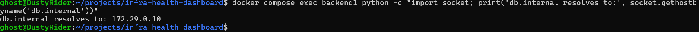

# Test 04 — Internal DNS Resolution

## 1. What Is This Test?

The Internal DNS Resolution test verifies that the backend can resolve the PostgreSQL database using the custom internal DNS hostname:

    db.internal

The Infra Health Dashboard uses a dedicated `dns` service running dnsmasq to provide internal service discovery.

The intended DNS mapping is:

    db.internal → 172.29.0.10

where `172.29.0.10` is the private IP address assigned to the PostgreSQL database.

---

## 2. Why Does This Matter?

Applications should generally communicate with services using stable service names rather than depending directly on hard-coded IP addresses.

DNS-based service discovery provides:

- Stable service names
- Decoupling between applications and infrastructure IP addresses
- Easier configuration management
- Better portability across environments
- A foundation for service discovery architectures

In this project, the backend uses `db.internal` to locate PostgreSQL through the private DNS layer.

This demonstrates how an internal DNS service can provide service discovery inside a containerized infrastructure.

---

## 3. Test Objective

The objective of this test is to prove that Backend 1 can resolve the internal database hostname through the configured DNS infrastructure.

The expected resolution is:

    db.internal → 172.29.0.10

The intended communication path is:

    Backend 1
        ↓
    Internal DNS
        ↓
    db.internal
        ↓
    172.29.0.10
        ↓
    PostgreSQL

---

## 4. Test Environment

The test is performed locally using:

- Windows 11
- WSL2
- Docker Desktop
- Docker Engine
- Docker Compose

The relevant services are:

- `backend1`
- `dns`
- `database`

The database is assigned the private address:

    172.29.0.10

The backend is configured to use the project's internal DNS service for name resolution.

---

## 5. Steps to Conduct the Test

Navigate to the project directory:

    cd ~/projects/infra-health-dashboard

Execute the DNS resolution test from inside Backend 1:

    docker compose exec backend1 python -c "import socket; print('db.internal resolves to:', socket.gethostbyname('db.internal'))"

The command uses Python's socket resolver from inside the backend container.

This is important because the test validates DNS resolution from the same network environment in which the application operates.

---

## 6. Expected Result

The command should return:

    db.internal resolves to: 172.29.0.10

The test passes when:

1. `db.internal` resolves successfully.
2. The resolved address is `172.29.0.10`.
3. No DNS resolution error is returned.

---

## 7. Test Evidence

The following screenshot shows Backend 1 successfully resolving the internal PostgreSQL hostname.

---

## 8. Actual Test Output

The command was executed from inside the `backend1` container.

The observed output was:

    db.internal resolves to: 172.29.0.10

No DNS resolution error occurred.

---

## 9. Output Explanation

### `db.internal`

The hostname `db.internal` is the custom internal DNS name used by the backend to locate PostgreSQL.

The successful resolution confirms that the backend can use the internal DNS namespace instead of relying on a database IP address directly.

---

### `172.29.0.10`

The hostname resolved to:

    172.29.0.10

This matches the configured private IP address of the PostgreSQL database.

Therefore, the DNS response points the backend to the expected database endpoint.

---

### Resolution from Backend 1

The command was executed inside the `backend1` container rather than from the host machine.

This is important because Docker containers have their own network and DNS configuration.

A successful resolution from Backend 1 demonstrates that the application's actual runtime environment can resolve the database service correctly.

---

## 10. Test Result

### PASS

The internal DNS resolution test successfully passed.

Backend 1 resolved:

    db.internal

to the expected PostgreSQL address:

    172.29.0.10

This confirms that the internal DNS service is providing the expected service-discovery mapping to the backend.

---

## 11. DevOps Relevance

Internal DNS and service discovery are fundamental concepts in modern infrastructure.

The same principle appears in technologies such as:

- Docker Compose service discovery
- Kubernetes DNS
- Kubernetes Services
- Cloud service discovery
- Consul
- Internal DNS zones
- Microservice architectures

This test demonstrates that application connectivity can be based on a stable service name rather than a hard-coded infrastructure address.

