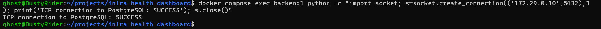

# Test 05 — Backend to PostgreSQL Connectivity

## 1. What Is This Test?

This test verifies that **Backend 1 can establish a network connection to the PostgreSQL database** across the private `backend-net`.

The intended communication path is:

    Backend 1
        ↓
    backend-net
        ↓
    PostgreSQL
    172.29.0.10:5432

This test focuses specifically on **network-level TCP connectivity** between the backend and database.

DNS resolution was validated separately in Test 4. Therefore, this test connects directly to the PostgreSQL IP address to isolate and validate the network connection itself.

---

## 2. Why Does This Matter?

A backend application is only useful if it can communicate with its database.

This test validates that:

- Backend 1 has access to the private network.
- PostgreSQL is reachable on its expected port.
- The Docker network allows the intended backend-to-database communication.
- The private network architecture is functioning as designed.

This test also helps separate different infrastructure failure domains.

For example:

- If DNS resolution fails, the issue may be related to service discovery.
- If DNS works but TCP connectivity fails, the issue may be related to networking, firewall rules, port availability, or the database service.
- If TCP connectivity works but database queries fail, the issue may be related to authentication or application/database configuration.

---

## 3. Test Objective

The objective is to prove that Backend 1 can establish a TCP connection to PostgreSQL at:

    172.29.0.10:5432

Expected communication path:

    Backend 1
       │
       │ TCP connection
       ▼
    172.29.0.10:5432
       │
       ▼
    PostgreSQL

---

## 4. Test Environment

The test is performed locally using:

- Windows 11
- WSL2
- Docker Desktop
- Docker Engine
- Docker Compose

Relevant services:

- `backend1`
- `database`

Network:

- `backend-net`

PostgreSQL endpoint:

    IP: 172.29.0.10
    Port: 5432

---

## 5. Steps to Conduct the Test

Navigate to the project directory:

    cd ~/projects/infra-health-dashboard

Execute the connectivity test from inside Backend 1:

    docker compose exec backend1 python -c "import socket; s=socket.create_connection(('172.29.0.10',5432),3); print('TCP connection to PostgreSQL: SUCCESS'); s.close()"

The command uses Python's socket library to establish a TCP connection to PostgreSQL on port `5432`.

The connection is then closed after the successful test.

Running the test from inside Backend 1 is important because it verifies connectivity from the application's actual container environment.

---

## 6. Expected Result

A successful test should produce:

    TCP connection to PostgreSQL: SUCCESS

This confirms that Backend 1 can reach PostgreSQL over the private Docker network.

A timeout, connection refusal, or other socket error would indicate that the expected network-level connectivity is not available.

---

## 7. Test Evidence

The following screenshot shows Backend 1 successfully establishing a TCP connection to PostgreSQL.

---

## 8. Actual Test Output

The connectivity command was executed from inside `backend1`.

The observed output was:

    TCP connection to PostgreSQL: SUCCESS

The command completed successfully and returned to the shell without an error.

---

## 9. Output Explanation

### TCP connection to PostgreSQL

The successful message confirms that Backend 1 was able to establish a TCP connection to the PostgreSQL endpoint.

The test targeted:

    172.29.0.10:5432

Port `5432` is the standard PostgreSQL TCP port.

---

### Private network connectivity

Because the connection was initiated from inside Backend 1, the result confirms that Backend 1 has network-level access to the private database endpoint.

This validates the intended backend-to-database communication path through `backend-net`.

---

### What this test does not prove

A successful TCP connection proves network reachability, but it does not by itself prove that:

- PostgreSQL authentication succeeds.
- A database query succeeds.
- The application can read data.
- Database credentials are correct.

Those are higher-level application/database checks and are validated separately.

---

## 10. Test Result

### PASS

The backend-to-PostgreSQL connectivity test successfully passed.

Backend 1 successfully established a TCP connection to:

    172.29.0.10:5432

This confirms that the intended network-level communication between the backend and PostgreSQL is functioning correctly across the private Docker network.

---

## 11. DevOps Relevance

Network connectivity testing is a fundamental troubleshooting and validation technique in DevOps.

When debugging distributed applications, engineers commonly validate connectivity in layers:

1. Network exists.
2. Container is attached to the correct network.
3. DNS resolves the service.
4. TCP connectivity succeeds.
5. Application protocol responds.
6. Authentication succeeds.
7. Application data can be retrieved.

This test validates layer 4 — **TCP connectivity** — and helps isolate network problems from higher-level application problems.
