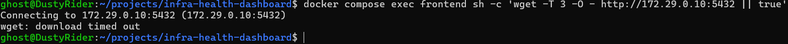

# Test 06 — Frontend to PostgreSQL Network Isolation

## 1. What Is This Test?

This test verifies that the **frontend container cannot directly connect to the PostgreSQL database**.

The intended architecture is:

    Frontend
       │
       │ Direct database access
       X
    PostgreSQL
    172.29.0.10:5432

The frontend is connected to `frontend-net`, while PostgreSQL is isolated on the private `backend-net`.

This test intentionally attempts the connection and expects it to fail.

---

## 2. Why Does This Matter?

The frontend is a user-facing component and should not have direct access to the database.

If the frontend could directly reach PostgreSQL, a compromise of the frontend container could potentially provide an unnecessary path toward the database.

The architecture therefore enforces network isolation:

    frontend-net
         │
         ├── Frontend
         └── Load Balancer

    backend-net
         │
         ├── Backend 1
         ├── Backend 2
         ├── Database
         └── DNS

The backend services provide the application layer that communicates with PostgreSQL.

---

## 3. Test Objective

The objective is to prove that:

    Frontend → PostgreSQL:5432

is unreachable.

At the same time, the previous backend connectivity test demonstrated that:

    Backend 1 → PostgreSQL:5432

is reachable.

Together, these tests demonstrate the intended network boundary:

    Frontend  ──X──> PostgreSQL
    Backend  ──────> PostgreSQL

---

## 4. Test Environment

The test is performed locally using:

- Windows 11
- WSL2
- Docker Desktop
- Docker Engine
- Docker Compose

Relevant services:

- `frontend`
- `database`

Networks:

- `frontend-net`
- `backend-net`

PostgreSQL endpoint:

    IP: 172.29.0.10
    Port: 5432

The test is performed from inside the `frontend` container.

---

## 5. Steps to Conduct the Test

Navigate to the project directory:

    cd ~/projects/infra-health-dashboard

Execute the connectivity test from inside the frontend container:

    docker compose exec frontend sh -c 'wget -T 3 -O - http://172.29.0.10:5432 || true'

The command attempts to establish a connection to the PostgreSQL TCP endpoint from the frontend container.

The `-T 3` option limits the connection attempt to three seconds.

The `|| true` portion prevents the expected connection failure from causing the shell command itself to return a failure status.

---

## 6. Expected Result

The connection should fail or time out.

A successful isolation test may produce output similar to:

    Connecting to 172.29.0.10:5432
    wget: download timed out

The exact wording may vary depending on the environment.

The important condition is that the frontend cannot establish a connection to PostgreSQL.

---

## 7. Test Evidence

The following screenshot shows the frontend attempting to connect to PostgreSQL and the connection timing out.

---

## 8. Actual Test Output

The test was executed from inside the `frontend` container.

The observed output was:

    Connecting to 172.29.0.10:5432 (172.29.0.10:5432)
    wget: download timed out

The connection attempt timed out after the configured three-second timeout.

---

## 9. Output Explanation

### Connection attempt

The frontend attempted to reach:

    172.29.0.10:5432

This is the PostgreSQL endpoint on the private backend network.

The fact that the connection was attempted from inside the frontend container is important because it tests the actual network environment available to the frontend service.

---

### Connection timeout

The command returned:

    wget: download timed out

This indicates that the frontend could not establish the requested connection to the PostgreSQL endpoint within the configured timeout.

For this test, the timeout is the expected result.

The objective is not to make the connection succeed; the objective is to demonstrate that the frontend does **not** have a direct network path to PostgreSQL.

---

### Network isolation

The result is consistent with the project's network architecture:

    Frontend
       │
       X
       │
    PostgreSQL

The frontend is not given direct access to the private database network.

This prevents the frontend from bypassing the backend application layer and communicating directly with PostgreSQL.

---

## 10. Test Result

### PASS

The frontend-to-PostgreSQL isolation test successfully passed.

The frontend attempted to connect to:

    172.29.0.10:5432

but the connection timed out.

This confirms that the frontend does not have a working direct network path to PostgreSQL, consistent with the intended network isolation design.

The previous backend connectivity test demonstrated the complementary behavior: Backend 1 can reach PostgreSQL successfully.

Together, these results demonstrate that database access is restricted to the intended backend network path.

