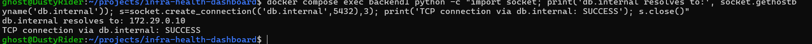

# Test 07 — Backend to PostgreSQL via Internal DNS

## 1. What Is This Test?

This test verifies that Backend 1 can reach the PostgreSQL database using the internal DNS hostname rather than connecting directly to the database IP address.

The intended communication path is:

    Backend 1
        ↓
    db.internal
        ↓
    Internal DNS
        ↓
    172.29.0.10
        ↓
    PostgreSQL :5432

Test 4 independently verified DNS resolution, while Test 5 independently verified TCP connectivity to PostgreSQL. This test combines both layers into one end-to-end connectivity check using the hostname that the application is designed to use.

---

## 2. Why Does This Matter?

This test validates the actual service-discovery path used by the backend.

Instead of depending on a hard-coded database IP address, the backend can use the stable hostname:

    db.internal

This provides a clear separation between application configuration and infrastructure addressing.

The test also confirms that DNS resolution and network connectivity work together from the backend container.

---

## 3. Test Objective

The objective is to prove that Backend 1 can:

1. Resolve `db.internal`.
2. Receive the expected PostgreSQL IP address.
3. Use `db.internal` to establish a TCP connection to PostgreSQL.
4. Reach PostgreSQL on port `5432`.

Expected result:

    db.internal resolves to: 172.29.0.10
    TCP connection via db.internal: SUCCESS

Both results are required for the test to pass.

---

## 4. Test Environment

The test is performed locally using:

- Windows 11
- WSL2
- Docker Desktop
- Docker Engine
- Docker Compose

Relevant services:

- `backend1`
- `dns`
- `database`

Network:

- `backend-net`

Database service discovery:

    Hostname: db.internal
    Resolved IP: 172.29.0.10
    Port: 5432

The test is executed from inside the `backend1` container.

---

## 5. Steps to Conduct the Test

Navigate to the project directory:

    cd ~/projects/infra-health-dashboard

Execute the DNS and TCP connectivity test from inside Backend 1:

    docker compose exec backend1 python -c "import socket; print('db.internal resolves to:', socket.gethostbyname('db.internal')); s=socket.create_connection(('db.internal',5432),3); print('TCP connection via db.internal: SUCCESS'); s.close()"

The command performs two operations.

First, it resolves `db.internal`.

Second, it uses the hostname directly to establish a TCP connection to PostgreSQL on port `5432`.

---

## 6. Expected Result

A successful test should produce:

    db.internal resolves to: 172.29.0.10
    TCP connection via db.internal: SUCCESS

The first line proves that the internal DNS name resolves to the expected database address.

The second line proves that the resolved endpoint is reachable from Backend 1.

---

## 7. Test Evidence

The following screenshot shows Backend 1 successfully resolving the internal database hostname and establishing a TCP connection through that hostname.

---

## 8. Actual Test Output

The command was executed from inside the `backend1` container.

The observed output was:

    db.internal resolves to: 172.29.0.10
    TCP connection via db.internal: SUCCESS

Both operations completed successfully and the command returned to the shell without an error.

---

## 9. Output Explanation

### DNS resolution

The output shows:

    db.internal resolves to: 172.29.0.10

This confirms that the backend can resolve the internal database hostname through the configured DNS infrastructure.

The returned address matches the configured private IP address of PostgreSQL.

---

### TCP connectivity through the hostname

The output then shows:

    TCP connection via db.internal: SUCCESS

This confirms that the backend did not merely resolve the hostname; it successfully used that hostname to establish a TCP connection to PostgreSQL on port `5432`.

Therefore, both service discovery and network connectivity are functioning together.

---

### End-to-end service discovery path

The complete validated path is:

    Backend 1
        ↓
    db.internal
        ↓
    DNS resolution
        ↓
    172.29.0.10:5432
        ↓
    PostgreSQL

This represents the actual hostname-based connectivity model used by the backend.

---

## 10. Test Result

### PASS

The Backend-to-PostgreSQL via Internal DNS test successfully passed.

Backend 1 successfully resolved:

    db.internal

to:

    172.29.0.10

and successfully established a TCP connection to PostgreSQL using the hostname:

    db.internal:5432

This confirms that the internal DNS service-discovery path and the private backend-to-database network path are functioning together as designed.
