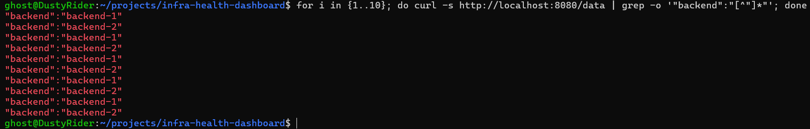

# Test 08 — Load Balancer Routing to Backend 1

## 1. What Is This Test?

This test verifies that the **NGINX Load Balancer can successfully route application requests to Backend 1**.

The request path is:

    Client
       ↓
    NGINX Load Balancer :8080
       ↓
    Backend 1 :5000

The backend response contains its backend identity, allowing us to verify which backend handled each request.

---

## 2. Why Does This Matter?

The project uses two backend instances behind the NGINX load balancer.

The load balancer is responsible for:

- Receiving client requests
- Selecting an available backend
- Forwarding the request
- Returning the backend response

Before validating failure handling, it is important to confirm that the load balancer can successfully route traffic to each backend.

---

## 3. Test Objective

The objective is to prove that a request sent to:

    http://localhost:8080/data

can be forwarded by NGINX to Backend 1.

The backend identifies itself in the response using:

    "backend":"backend-1"

The test also provides visibility into the behavior of the second backend because the request sequence is sent through the same load balancer.

---

## 4. Test Environment

The test is performed locally using:

- Windows 11
- WSL2
- Docker Desktop
- Docker Compose
- NGINX Load Balancer
- Backend 1
- Backend 2

Load Balancer:

    Host: localhost
    Port: 8080

Backend service:

    Container port: 5000

Backend 1 identity:

    backend-1

Backend 2 identity:

    backend-2

---

## 5. Steps to Conduct the Test

Navigate to the project directory:

    cd ~/projects/infra-health-dashboard

Send 10 requests through the NGINX load balancer:

    for i in {1..10}; do curl -s http://localhost:8080/data | grep -o '"backend":"[^"]*"'; done

Each request is sent to the load balancer rather than directly to either backend.

The backend identity returned in each response shows which backend processed the request.

---

## 6. Expected Result

The output should contain:

    "backend":"backend-1"

at least once.

Because both backends are healthy and available, the output may also contain:

    "backend":"backend-2"

That is expected.

The key requirement for this test is that the load balancer successfully forwards traffic to Backend 1.

---

## 7. Test Evidence

The following screenshot shows the 10 requests sent through the NGINX load balancer and the backend identity returned for each request.

---

## 8. Actual Test Output

The test sent 10 requests to:

    http://localhost:8080/data

The observed responses alternated between Backend 1 and Backend 2:

    "backend":"backend-1"
    "backend":"backend-2"
    "backend":"backend-1"
    "backend":"backend-2"
    "backend":"backend-1"
    "backend":"backend-2"
    "backend":"backend-1"
    "backend":"backend-2"
    "backend":"backend-1"
    "backend":"backend-2"

Backend 1 handled 5 of the 10 requests, while Backend 2 handled the other 5.

---

## 9. Output Explanation

### Backend 1 response

The output contains multiple occurrences of:

    "backend":"backend-1"

This confirms that the load balancer successfully forwarded requests to Backend 1.

The response came through the public load balancer endpoint rather than from a direct request to Backend 1.

---

### Backend 2 response

The output also contains:

    "backend":"backend-2"

This confirms that the same load balancer is also routing requests to Backend 2.

This behavior is expected because both backend instances are healthy and configured as load-balancer targets.

---

### Request distribution

The 10 requests produced:

    Backend 1: 5 requests
    Backend 2: 5 requests

The observed alternating pattern demonstrates that the NGINX load balancer is actively distributing requests between the available backend instances.

This also provides stronger evidence than simply receiving one successful Backend 1 response because the test demonstrates that the load balancer is communicating with both configured backend targets.

---

## 10. Test Result

### PASS

The Load Balancer Routing to Backend 1 test successfully passed.

The NGINX load balancer accepted requests through:

    localhost:8080

and successfully routed traffic to Backend 1, confirmed by the responses containing:

    "backend":"backend-1"

The same test also showed successful routing to Backend 2, with an observed distribution of 5 requests to each backend.

This confirms that the load balancer can successfully communicate with Backend 1 while distributing traffic across the healthy backend pool.
