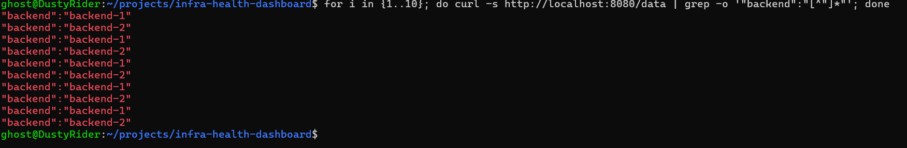

# Test 09 — Load Balancer Routing to Backend 2

## 1. What Is This Test?

This test verifies that the **NGINX Load Balancer can successfully route application requests to Backend 2**.

The request path is:

    Client
       ↓
    NGINX Load Balancer :8080
       ↓
    Backend 2 :5000

Backend 2 identifies itself in the `/data` response, allowing us to verify that the request was actually processed by the second backend instance.

---

## 2. Why Does This Matter?

The project uses two backend instances to provide redundancy and distribute application traffic.

Backend 2 must be reachable through the load balancer just like Backend 1.

This test verifies that:

- Backend 2 is registered as a load-balancer target.
- NGINX can communicate with Backend 2.
- Requests sent through the public load-balancer endpoint can reach Backend 2.
- The second backend is actively serving application traffic.

---

## 3. Test Objective

The objective is to prove that requests sent to:

    http://localhost:8080/data

can be routed by NGINX to Backend 2.

The expected response contains:

    "backend":"backend-2"

---

## 4. Test Environment

The test is performed locally using:

- Windows 11
- WSL2
- Docker Desktop
- Docker Engine
- Docker Compose

Relevant components:

- NGINX Load Balancer
- Backend 1
- Backend 2
- `frontend-net`

Load Balancer:

    Host: localhost
    Port: 8080

Backend 2:

    Container port: 5000
    Backend identity: backend-2

---

## 5. Steps to Conduct the Test

Navigate to the project directory:

    cd ~/projects/infra-health-dashboard

Send 10 requests through the NGINX load balancer:

    for i in {1..10}; do curl -s http://localhost:8080/data | grep -o '"backend":"[^"]*"'; done

Each request is sent to the load balancer rather than directly to Backend 2.

The backend identity returned in each response shows which backend processed the request.

---

## 6. Expected Result

The output should contain:

    "backend":"backend-2"

at least once.

The output may also contain:

    "backend":"backend-1"

because both backends are healthy and available in the load-balancer pool.

The key requirement is that Backend 2 appears in the responses.

---

## 7. Test Evidence

The following screenshot shows requests sent through the NGINX load balancer and the backend identity returned for each request.

---

## 8. Actual Test Output

The test sent 10 requests to:

    http://localhost:8080/data

The observed responses alternated between Backend 1 and Backend 2:

    "backend":"backend-1"
    "backend":"backend-2"
    "backend":"backend-1"
    "backend":"backend-2"
    "backend":"backend-1"
    "backend":"backend-2"
    "backend":"backend-1"
    "backend":"backend-2"
    "backend":"backend-1"
    "backend":"backend-2"

Backend 1 handled 5 of the 10 requests, while Backend 2 handled the other 5.

---

## 9. Output Explanation

### Backend 2 response

The output contains multiple occurrences of:

    "backend":"backend-2"

This confirms that the NGINX load balancer successfully forwarded requests to Backend 2.

The requests were sent to the load balancer endpoint rather than directly to the Backend 2 container.

---

### Backend 1 response

The output also contains:

    "backend":"backend-1"

This is expected because Backend 1 is also healthy and configured as a load-balancer target.

Its presence demonstrates that the load balancer continues to use both available backend instances.

---

### Request distribution

The 10 requests produced:

    Backend 1: 5 requests
    Backend 2: 5 requests

The observed alternating pattern demonstrates that the NGINX load balancer is distributing requests across the healthy backend pool.

The presence of Backend 2 in the responses confirms that the second backend is actively participating in application traffic.

---

## 10. Test Result

### PASS

The Load Balancer Routing to Backend 2 test successfully passed.

The NGINX load balancer accepted requests through:

    localhost:8080

and successfully routed traffic to Backend 2, confirmed by the responses containing:

    "backend":"backend-2"

The test also showed successful routing to Backend 1, with an observed distribution of 5 requests to each backend.

This confirms that Backend 2 is reachable through the NGINX load balancer and is actively serving application traffic.
