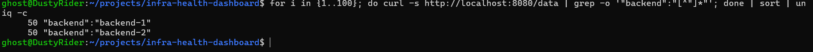

# Test 10 — Load Balancer Traffic Distribution

## 1. What Is This Test?

This test verifies that the NGINX Load Balancer distributes incoming application requests across both healthy backend instances.

The traffic flow is:

    Client
       ↓
    NGINX Load Balancer :8080
       ↓
       ├── Backend 1
       └── Backend 2

Tests 8 and 9 verified that each backend can receive traffic through the load balancer. This test focuses specifically on how traffic is distributed across the healthy backend pool.

---

## 2. Why Does This Matter?

A load balancer should distribute application traffic across multiple healthy backend instances rather than sending all requests to a single instance.

Distributing traffic provides:

- Better utilization of backend instances
- Increased application capacity
- Redundancy
- Reduced dependency on a single backend
- A foundation for handling backend failures

This test validates the actual runtime behavior of the load balancer.

---

## 3. Test Objective

The objective is to send 100 requests through:

    http://localhost:8080/data

and count how many responses are handled by:

    backend-1

and:

    backend-2

The test should demonstrate that both healthy backend instances receive traffic.

An exact 50/50 distribution is not required for this test because load-balancing behavior can vary depending on implementation and request timing.

---

## 4. Test Environment

The test is performed locally using:

- Windows 11
- WSL2
- Docker Desktop
- Docker Engine
- Docker Compose

Relevant components:

- NGINX Load Balancer
- Backend 1
- Backend 2

Load Balancer:

    localhost:8080

Application endpoint:

    /data

Number of requests:

    100

---

## 5. Steps to Conduct the Test

Navigate to the project directory:

    cd ~/projects/infra-health-dashboard

Send 100 requests through the load balancer and count the backend responses:

    for i in {1..100}; do curl -s http://localhost:8080/data | grep -o '"backend":"[^"]*"'; done | sort | uniq -c

The command:

1. Sends 100 requests to the load balancer.
2. Extracts the backend identity from each response.
3. Sorts the identities.
4. Counts the number of responses from each backend.

---

## 6. Expected Result

Both backend instances should appear in the final count.

For example:

    48 "backend":"backend-1"
    52 "backend":"backend-2"

The exact distribution may vary.

The important requirement is:

    backend-1 → receives traffic
    backend-2 → receives traffic

A result where only one backend receives all 100 requests would require investigation.

---

## 7. Test Evidence

The following screenshot shows the 100 requests distributed across Backend 1 and Backend 2.

---

## 8. Actual Test Output

The test sent 100 requests through:

    http://localhost:8080/data

The observed result was:

    50 "backend":"backend-1"
    50 "backend":"backend-2"

Therefore:

    Backend 1: 50 requests
    Backend 2: 50 requests
    Total: 100 requests

---

## 9. Output Explanation

### Backend 1

The output shows:

    50 "backend":"backend-1"

This means Backend 1 processed 50 of the 100 requests sent through the load balancer.

---

### Backend 2

The output shows:

    50 "backend":"backend-2"

This means Backend 2 processed the other 50 requests.

---

### Traffic distribution

The final distribution was:

    Backend 1: 50%
    Backend 2: 50%

This is an exactly even distribution for the 100-request test.

The result demonstrates that both healthy backend instances are actively participating in traffic handling.

---

## 10. Test Result

### PASS

The Load Balancer Traffic Distribution test successfully passed.

100 requests were sent through the NGINX load balancer, and the traffic was distributed evenly:

    Backend 1: 50 requests
    Backend 2: 50 requests

Both backend instances successfully received traffic through the shared load-balancer endpoint.

This confirms that the load balancer is distributing requests across the healthy backend pool as expected.
