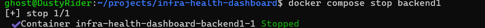
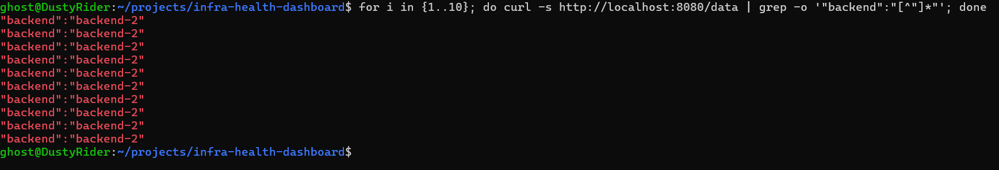

# Test 11 — Backend Failure Detection and Traffic Rerouting

## 1. What Is This Test?

This test intentionally stops Backend 1 and verifies that the NGINX Load Balancer detects the backend failure and continues routing application traffic to Backend 2.

Under normal conditions, traffic can be distributed across both backends:

    Client
       ↓
    NGINX Load Balancer
       ↓
       ├── Backend 1
       └── Backend 2

During the failure test:

    Client
       ↓
    NGINX Load Balancer
       ↓
       ├── Backend 1 ❌
       └── Backend 2 ✅

The objective is to verify that Backend 2 continues serving requests after Backend 1 is stopped.

---

## 2. Why Does This Matter?

A load balancer should not continue sending new requests to an unavailable backend.

When one backend fails, the expected behavior is:

1. The backend becomes unavailable.
2. The load balancer's health-check mechanism detects the failure.
3. The failed backend is removed from the active upstream pool.
4. Traffic is routed to the remaining healthy backend.
5. The application remains available.

This test validates the failure-handling behavior of the load-balancing layer rather than only testing normal operation.

---

## 3. Test Objective

The objective is to prove that after Backend 1 is intentionally stopped:

- Backend 1 becomes unavailable.
- The load balancer detects the failure.
- Backend 2 continues serving application requests.
- Requests through the load balancer continue to return successful backend responses.

The expected traffic path after failure is:

    Client
       ↓
    NGINX Load Balancer :8080
       ↓
    Backend 2 :5000

---

## 4. Test Environment

The test is performed locally using:

- Windows 11
- WSL2
- Docker Desktop
- Docker Engine
- Docker Compose

Relevant services:

- `loadbalancer`
- `backend1`
- `backend2`

Load Balancer:

    localhost:8080

Application endpoint:

    /data

Backend 1:

    backend-1

Backend 2:

    backend-2

The load balancer uses an active health-check script to check backend availability and update its upstream configuration.

---

## 5. Steps to Conduct the Test

### Step 1 — Stop Backend 1

Run:

    docker compose stop backend1

This intentionally stops the first backend instance.

---

### Step 2 — Allow the health check to detect the failure

Wait approximately 5 seconds.

The load balancer's health-check process runs periodically and needs time to detect that Backend 1 is no longer responding.

---

### Step 3 — Send requests through the load balancer

Run:

    for i in {1..10}; do curl -s http://localhost:8080/data | grep -o '"backend":"[^"]*"'; done

The requests are sent to the load balancer rather than directly to Backend 2.

---

## 6. Expected Result

After Backend 1 has been stopped and the health-check interval has elapsed, the requests should be served by Backend 2.

Expected output:

    "backend":"backend-2"

repeated for the requests sent through the load balancer.

The important condition is:

    Backend 1 → unavailable
    Backend 2 → continues serving traffic
    Load Balancer → continues responding

---

## 7. Test Evidence

The following screenshots show Backend 1 being stopped and subsequent requests being served by Backend 2.

---

## 8. Actual Test Output

### Backend 1 failure

The command:

    docker compose stop backend1

successfully stopped the Backend 1 container.

Docker reported:

    Container infra-health-dashboard-backend1-1 Stopped

---

### Traffic after failure

After allowing the health-check mechanism time to detect the failure, 10 requests were sent through:

    http://localhost:8080/data

Every observed response identified Backend 2:

    "backend":"backend-2"
    "backend":"backend-2"
    "backend":"backend-2"
    "backend":"backend-2"
    "backend":"backend-2"
    "backend":"backend-2"
    "backend":"backend-2"
    "backend":"backend-2"
    "backend":"backend-2"
    "backend":"backend-2"

Backend 2 handled all 10 requests after Backend 1 was stopped.

---

## 9. Output Explanation

### Backend 1 was intentionally stopped

The first screenshot shows that:

    docker compose stop backend1

successfully stopped the Backend 1 container.

This creates the failure condition required for the test.

This is an intentional failure and is therefore not itself considered a failed test.

---

### Backend 2 continued serving traffic

After Backend 1 was stopped, all 10 requests returned:

    "backend":"backend-2"

This confirms that the load balancer continued to provide application responses even though one backend was unavailable.

---

### Traffic rerouting

The important observation is that no response from the post-failure request set identified Backend 1.

Instead:

    Backend 1 → 0 requests
    Backend 2 → 10 requests

This demonstrates that the load balancer stopped routing new application requests to the failed backend and continued using the healthy backend.

---

### Application availability

The load balancer remained reachable at:

    localhost:8080

and continued returning valid `/data` responses.

Therefore, the failure of one backend did not make the load-balancer endpoint unavailable.

---

## 10. Test Result

### PASS

The Backend Failure Detection and Traffic Rerouting test successfully passed.

Backend 1 was intentionally stopped, after which the load balancer continued serving application requests through Backend 2.

The 10 post-failure requests produced:

    Backend 1: 0 requests
    Backend 2: 10 requests

This confirms that the load-balancing layer successfully handled the backend failure and continued routing traffic to the remaining healthy backend.

