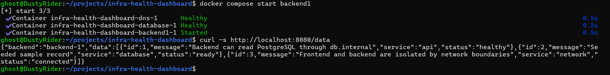

# Test 12 — End-to-End Application Data Flow

## 1. What Is This Test?

This test validates the complete application data flow from the client through the NGINX Load Balancer to a backend, then through internal DNS to PostgreSQL, and finally back to the client with database records.

The intended communication path is:

    Client
       ↓
    NGINX Load Balancer :8080
       ↓
    Backend
       ↓
    db.internal
       ↓
    PostgreSQL
       ↓
    Seeded database records
       ↓
    Backend response
       ↓
    Client

Unlike the previous tests, which validated individual infrastructure components, this test verifies that the complete application path works together.

---

## 2. Why Does This Matter?

Individual infrastructure components can be healthy while the complete application flow is still broken.

For example:

- DNS can resolve correctly while database connectivity fails.
- PostgreSQL can be running while the backend cannot query it.
- The backend can work directly while the load balancer fails to route requests.
- The load balancer can be reachable while the backend cannot retrieve application data.

An end-to-end test validates the complete chain and provides stronger evidence that the infrastructure and application components are integrated correctly.

---

## 3. Test Objective

The objective is to prove that a request sent to:

    http://localhost:8080/data

can:

1. Reach the NGINX Load Balancer.
2. Be forwarded to a healthy backend.
3. Allow the backend to communicate with PostgreSQL through `db.internal`.
4. Retrieve the seeded PostgreSQL records.
5. Return the database data successfully to the client.

The response should contain a backend identity and a populated `data` array.

---

## 4. Test Environment

The test is performed locally using:

- Windows 11
- WSL2
- Docker Desktop
- Docker Engine
- Docker Compose

Relevant components:

- NGINX Load Balancer
- Backend 1
- Backend 2
- DNS / dnsmasq
- PostgreSQL

Load Balancer:

    localhost:8080

Application endpoint:

    /data

Database service discovery hostname:

    db.internal

PostgreSQL private IP:

    172.29.0.10

---

## 5. Steps to Conduct the Test

### Step 1 — Restore Backend 1

Backend 1 was intentionally stopped during the previous failure test.

Start it again:

    docker compose start backend1

Wait approximately 5–10 seconds for Backend 1 and its dependencies to become ready.

---

### Step 2 — Request application data through the load balancer

Run:

    curl -s http://localhost:8080/data

The request is sent to the NGINX load balancer rather than directly to either backend.

The backend identity and returned database records can then be inspected in the JSON response.

---

## 6. Expected Result

The response should be valid JSON containing:

    "backend":"backend-1"

or:

    "backend":"backend-2"

The response should also contain a populated `data` array containing the seeded PostgreSQL records.

The test passes when the request successfully returns the expected application data through the load-balancer endpoint.

---

## 7. Test Evidence

The following screenshot shows Backend 1 being restored and the successful end-to-end `/data` response through the NGINX load balancer.

---

## 8. Actual Test Output

Backend 1 was successfully started.

Docker reported:

    Container infra-health-dashboard-dns-1 Healthy
    Container infra-health-dashboard-database-1 Healthy
    Container infra-health-dashboard-backend1-1 Started

A request was then sent to:

    http://localhost:8080/data

The response identified Backend 1:

    "backend":"backend-1"

The response also contained a populated `data` array with three records.

The returned records included:

    Backend can read PostgreSQL through db.internal

    Seeded sample record

    Frontend and backend are isolated by network boundaries

---

## 9. Output Explanation

### Backend identity

The response contains:

    "backend":"backend-1"

This confirms that the request sent to the load balancer was successfully forwarded to Backend 1.

The request was not sent directly to the backend container; it entered through the public load-balancer endpoint.

---

### Database data

The response contains a populated `data` array with three records.

This confirms that the backend successfully retrieved data from PostgreSQL and returned it as part of the application response.

---

### DNS-based database connectivity

The first database record contains:

    Backend can read PostgreSQL through db.internal

This corresponds to the database data seeded for the project and reinforces the intended database service-discovery design.

The earlier DNS and connectivity tests independently validated this path; this test demonstrates that the application can use that infrastructure as part of a complete request.

---

### Database readiness

The response also contains the seeded record:

    Seeded sample record

with:

    "status":"ready"

This confirms that the expected PostgreSQL seed data is available to the application.

---

### Network architecture record

The returned data includes:

    Frontend and backend are isolated by network boundaries

with:

    "status":"connected"

This is part of the seeded application data and represents the project's intended network architecture.

---

### Complete application path

The successful response demonstrates the following end-to-end flow:

    Client
       ↓
    NGINX Load Balancer
       ↓
    Backend 1
       ↓
    db.internal
       ↓
    PostgreSQL
       ↓
    Seeded records
       ↓
    Backend response
       ↓
    Client

All major application layers involved in the `/data` request successfully participated in the request.

---

## 10. Test Result

### PASS

The End-to-End Application Data Flow test successfully passed.

Backend 1 was restored successfully, and the request sent through:

    http://localhost:8080/data

returned a valid application response.

The response identified Backend 1 and contained all three expected seeded PostgreSQL records.

This confirms that the load balancer, backend application, internal DNS, PostgreSQL database, and application data flow are working together successfully.
