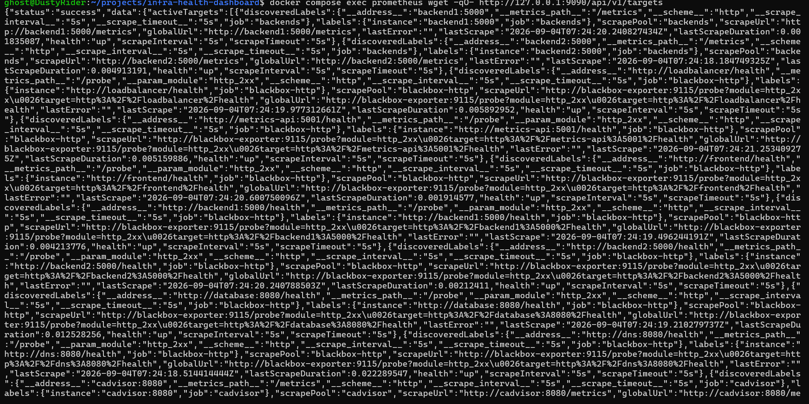

# Test 13 — Prometheus Target Health

## 1. What Is This Test?

This test verifies that **Prometheus can successfully reach and monitor the configured infrastructure and application targets**.

Prometheus collects metrics from the project and works together with:

- Backend `/metrics` endpoints
- Blackbox Exporter
- cAdvisor

The Prometheus Targets API provides the current state of each configured target.

For a healthy target, Prometheus reports:

    "health":"up"

---

## 2. Why Does This Matter?

A monitoring system is only useful if it can successfully reach the services it is responsible for monitoring.

A service can be running correctly from Docker's perspective while Prometheus is unable to monitor it because of:

- Incorrect target configuration
- Incorrect port
- Network connectivity problems
- DNS/service discovery problems
- Scrape endpoint problems
- Monitoring configuration errors

This test verifies that Prometheus can communicate with its configured targets and successfully perform monitoring scrapes and probes.

---

## 3. Test Objective

The objective is to query Prometheus's Targets API and verify that the configured monitoring targets report:

    "health":"up"

The project includes direct Prometheus scrape targets for:

- Backend 1
- Backend 2
- cAdvisor

Blackbox Exporter is also used to probe service health endpoints for:

- Load Balancer
- Metrics API
- Frontend
- Backend 1
- Backend 2
- Database
- DNS

---

## 4. Test Environment

The test is performed locally using:

- Windows 11
- WSL2
- Docker Desktop
- Docker Engine
- Docker Compose
- Prometheus
- Blackbox Exporter
- cAdvisor

Prometheus listens internally on:

    9090

The Prometheus API is queried from inside the Prometheus container because the current project configuration does not publish port `9090` to the host.

---

## 5. Steps to Conduct the Test

Navigate to the project directory:

    cd ~/projects/infra-health-dashboard

Query the Prometheus Targets API:

    docker compose exec prometheus wget -qO- http://127.0.0.1:9090/api/v1/targets

The command returns the currently discovered Prometheus targets and their scrape/probe state.

Look for:

    "health":"up"

in the returned target information.

---

## 6. Expected Result

The configured targets should report:

    "health":"up"

The response should contain healthy entries for the backend metrics targets, cAdvisor, and the Blackbox Exporter probe targets.

No target that is expected to be monitored should report an active scrape or probe failure.

---

## 7. Test Evidence

The following screenshot shows the Prometheus Targets API response containing the configured targets and successful `health` states.

---

## 8. Actual Test Output

The Prometheus Targets API was queried successfully from inside the Prometheus container.

The captured output contains the configured monitoring targets, including:

    backend1:5000/metrics
    backend2:5000/metrics
    loadbalancer/health
    metrics-api:5001/health
    frontend/health
    backend1:5000/health
    backend2:5000/health
    database:8080/health
    dns:8080/health
    cadvisor:8080/metrics

The visible target entries report:

    "health":"up"

and their `lastError` fields are empty.

---

## 9. Output Explanation

### Backend metrics targets

The output contains targets for:

    http://backend1:5000/metrics
    http://backend2:5000/metrics

Both report:

    "health":"up"

This confirms that Prometheus can successfully scrape the custom application metrics exposed by both backend instances.

---

### Blackbox Exporter targets

The output also contains Blackbox HTTP probe targets for the application's health endpoints.

The visible entries include:

    loadbalancer/health
    metrics-api:5001/health
    frontend/health
    backend1:5000/health
    backend2:5000/health
    database:8080/health
    dns:8080/health

These targets report:

    "health":"up"

This confirms that the Blackbox Exporter is successfully probing the configured service health endpoints and that Prometheus is receiving the probe results.

---

### cAdvisor

The output contains the cAdvisor metrics target:

    cadvisor:8080/metrics

The target is part of the Prometheus monitoring configuration and is visible in the captured response.

cAdvisor provides container-level resource metrics used by the monitoring layer.

---

### Empty lastError fields

The target entries shown in the screenshot have empty:

    "lastError"

fields.

This indicates that the latest scrape or probe did not report an error for those visible targets.

---

## 10. Test Result

### PASS

The Prometheus Target Health test successfully passed.

The Prometheus Targets API returned the configured monitoring targets, and the captured target entries report:

    "health":"up"

The output also shows empty `lastError` fields for the visible targets.

This confirms that Prometheus is successfully communicating with the project's application and infrastructure monitoring targets.
