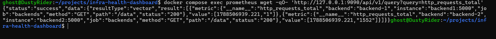

# Test 14 — Custom Backend Metrics Collection

## 1. What Is This Test?

This test verifies that the backend services expose custom application metrics that Prometheus can collect.

The backend application exposes a Prometheus counter named:

    http_requests_total

The metric includes labels that identify:

- Backend instance
- HTTP method
- Request path
- HTTP status code

For this project, `/data` requests are tracked so that the monitoring layer can determine how much application traffic each backend is handling.

---

## 2. Why Does This Matter?

Infrastructure monitoring can tell us whether a service is running, but application metrics provide visibility into what the application is actually doing.

Custom metrics allow us to determine:

- How many requests each backend has handled
- Which endpoint is receiving traffic
- Which HTTP status codes are being returned
- How application traffic is distributed between backend instances

These metrics are later used by the Metrics API and dashboard to produce the Live Traffic visualization.

---

## 3. Test Objective

The objective is to prove that Prometheus has collected the backend's custom:

    http_requests_total

metric.

We specifically want to verify that Prometheus contains request metrics for:

    job="backends"
    path="/data"

and that both backend instances are represented:

    backend-1
    backend-2

---

## 4. Test Environment

The test is performed locally using:

- Windows 11
- WSL2
- Docker Desktop
- Docker Engine
- Docker Compose
- Prometheus
- Backend 1
- Backend 2

Prometheus listens internally on:

    9090

The Prometheus API is queried from inside the Prometheus container.

---

## 5. Steps to Conduct the Test

Navigate to the project directory:

    cd ~/projects/infra-health-dashboard

Query Prometheus for the custom request metric:

    docker compose exec prometheus wget -qO- 'http://127.0.0.1:9090/api/v1/query?query=http_requests_total'

The query asks Prometheus for the current `http_requests_total` time series.

Inspect the returned metric labels for:

    backend-1
    backend-2
    job="backends"
    path="/data"
    status="200"

---

## 6. Expected Result

The Prometheus response should contain custom request metric series for both backend instances.

The expected metric structure includes:

    http_requests_total
    backend="backend-1"
    job="backends"
    path="/data"
    status="200"

and:

    http_requests_total
    backend="backend-2"
    job="backends"
    path="/data"
    status="200"

The counter values will depend on how much application traffic has been generated before the test.

---

## 7. Test Evidence

The following screenshot shows Prometheus returning the custom `http_requests_total` metrics for both backend instances.

---

## 8. Actual Test Output

The Prometheus API returned a successful response:

    "status":"success"

The result contained the `http_requests_total` metric for Backend 1:

    "backend":"backend-1"
    "instance":"backend1:5000"
    "job":"backends"
    "method":"GET"
    "path":"/data"
    "status":"200"

The result also contained the metric for Backend 2:

    "backend":"backend-2"
    "instance":"backend2:5000"
    "job":"backends"
    "method":"GET"
    "path":"/data"
    "status":"200"

The captured counter values were:

    Backend 1: 1
    Backend 2: 1552

at the instant represented by the Prometheus query.

---

## 9. Output Explanation

### Prometheus query succeeded

The response begins with:

    "status":"success"

This confirms that Prometheus successfully processed the query.

---

### Backend 1 metric

The response contains a metric series identified by:

    "backend":"backend-1"

with:

    "path":"/data"
    "status":"200"

This confirms that Prometheus has collected the custom application request counter for Backend 1.

---

### Backend 2 metric

The response also contains:

    "backend":"backend-2"

with:

    "path":"/data"
    "status":"200"

This confirms that Prometheus has collected the same custom application metric from Backend 2.

---

### HTTP status

Both visible metric series have:

    "status":"200"

This indicates that the tracked `/data` requests represented successful HTTP responses.

---

### Counter values

At the time of the captured query, the returned values were:

    Backend 1: 1
    Backend 2: 1552

These values are cumulative counter values and depend on the traffic that has reached each backend since the respective metric series started.

The difference in values is expected because the backends have handled different amounts of traffic during the current container lifetime.

The values should therefore not be interpreted as a current traffic rate.

---

## 10. Test Result

### PASS

The Custom Backend Metrics Collection test successfully passed.

Prometheus returned the custom `http_requests_total` metric for both Backend 1 and Backend 2.

Both metric series contain the expected:

    job="backends"
    path="/data"
    status="200"

labels.

This confirms that the backend application is exposing custom request metrics and that Prometheus is successfully collecting them.

