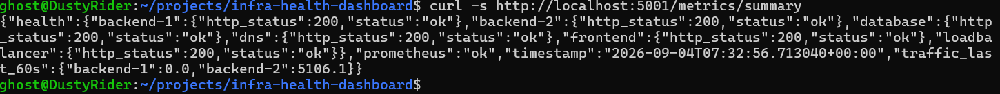

# Test 15 — Metrics API

## 1. What Is This Test?

This test verifies that the **Metrics API successfully collects and combines monitoring information from Prometheus and the service health endpoints**.

The Metrics API acts as the bridge between the monitoring layer and the React dashboard.

The intended flow is:

    Backend Metrics ──→ Prometheus
                             │
    Service Health ──────────┤
                             ↓
                        Metrics API
                             ↓
                         Dashboard

The API endpoint tested is:

    http://localhost:5001/metrics/summary

---

## 2. Why Does This Matter?

The dashboard should not need to communicate directly with every backend, database, DNS service, and monitoring component.

Instead, the Metrics API provides a single summarized response containing:

- Prometheus status
- Backend traffic
- Service health
- Timestamp

This creates a clear separation between the frontend presentation layer and the monitoring/data-aggregation logic.

---

## 3. Test Objective

The objective is to verify that the Metrics API successfully returns:

- Prometheus status
- Traffic data for Backend 1
- Traffic data for Backend 2
- Health status for the monitored services
- A valid timestamp

The expected response structure includes:

    prometheus
    traffic_last_60s
    health
    timestamp

---

## 4. Test Environment

The test is performed locally using:

- Windows 11
- WSL2
- Docker Desktop
- Docker Engine
- Docker Compose

Relevant services:

- Metrics API
- Prometheus
- Backend 1
- Backend 2
- Frontend
- Load Balancer
- Database
- DNS

Metrics API:

    localhost:5001

Endpoint:

    /metrics/summary

---

## 5. Steps to Conduct the Test

Navigate to the project directory:

    cd ~/projects/infra-health-dashboard

Query the Metrics API:

    curl -s http://localhost:5001/metrics/summary

The command queries the Metrics API directly and returns its aggregated monitoring information as JSON.

---

## 6. Expected Result

The API should return valid JSON containing:

    "prometheus":"ok"

The `traffic_last_60s` object should contain entries for:

    backend-1
    backend-2

The `health` object should contain the monitored services with successful HTTP status values.

The response should also contain a timestamp.

---

## 7. Test Evidence

The following screenshot shows the Metrics API returning the aggregated monitoring summary.

---

## 8. Actual Test Output

The Metrics API returned a successful JSON response.

The response contained:

    "prometheus":"ok"

The health section reported all monitored services as healthy:

    backend-1 → HTTP 200 → ok
    backend-2 → HTTP 200 → ok
    database → HTTP 200 → ok
    dns → HTTP 200 → ok
    frontend → HTTP 200 → ok
    loadbalancer → HTTP 200 → ok

The response also contained:

    "traffic_last_60s":{
        "backend-1":0.0,
        "backend-2":5106.1
    }

A timestamp was included:

    2026-09-04T07:32:56.713040+00:00

---

## 9. Output Explanation

### Prometheus status

The response contains:

    "prometheus":"ok"

This confirms that the Metrics API successfully communicated with Prometheus and received the monitoring data required for the summary.

---

### Service health

The `health` section reports HTTP 200 and `ok` for:

    backend-1
    backend-2
    database
    dns
    frontend
    loadbalancer

This confirms that the Metrics API was able to query the health endpoints of the monitored services successfully at the time of the test.

---

### Traffic data

The response contains:

    backend-1: 0.0
    backend-2: 5106.1

under `traffic_last_60s`.

These values represent the traffic calculation produced by the Metrics API from the Prometheus data for the recent 60-second window.

Backend 2 having a higher value than Backend 1 is not itself an error. Traffic values depend on the requests received during the measurement window.

---

### Timestamp

The response contains a timestamp:

    2026-09-04T07:32:56.713040+00:00

This allows consumers of the API, including the dashboard, to associate the returned monitoring information with a specific collection time.

---

## 10. Test Result

### PASS

The Metrics API test successfully passed.

The API returned a valid monitoring summary containing:

- Successful Prometheus status
- Traffic information for both backend instances
- Health information for all six monitored services
- A timestamp

This confirms that the Metrics API is successfully aggregating monitoring and service-health information for consumption by the dashboard.
