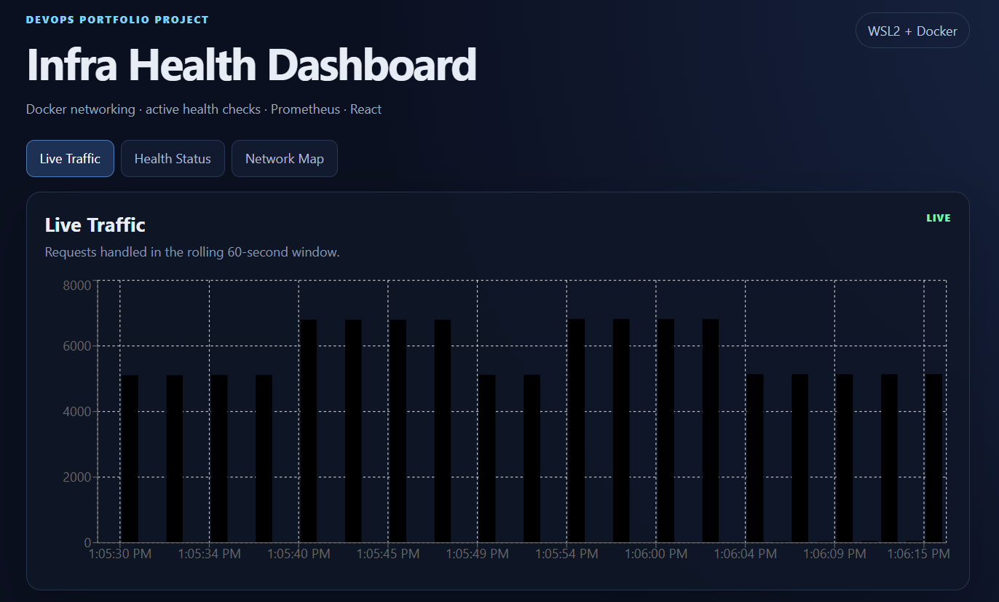

# Test 16 — Dashboard Live Traffic Visualization

## 1. What Is This Test?

This test verifies that the React dashboard successfully receives traffic information from the Metrics API and displays it in the **Live Traffic** visualization.

The monitoring data flow is:

    Backend 1 / Backend 2
            ↓
        Prometheus
            ↓
        Metrics API
            ↓
          Frontend
            ↓
      Live Traffic Chart

The dashboard displays requests handled within a rolling 60-second window.

---

## 2. Why Does This Matter?

Monitoring data collected by Prometheus needs to be presented in a form that can be quickly understood.

The Live Traffic visualization provides a direct view of application traffic handled by the backend instances.

This test verifies that the monitoring pipeline is not only collecting metrics but is also successfully delivering those metrics to the dashboard.

---

## 3. Test Objective

The objective is to verify that:

- The dashboard loads successfully.
- The Live Traffic section is displayed.
- Traffic data is visible in the chart.
- The chart represents activity from the backend services.
- The dashboard updates using the monitoring data supplied by the Metrics API.

---

## 4. Test Environment

The test is performed locally using:

- Windows 11
- WSL2
- Docker Desktop
- Docker Engine
- Docker Compose
- React
- Vite
- Recharts
- Metrics API
- Prometheus

Dashboard:

    http://localhost:3000

Live Traffic data source:

    Metrics API → /metrics/summary

Traffic measurement:

    Rolling 60-second window

---

## 5. Steps to Conduct the Test

Open the dashboard in a browser:

    http://localhost:3000

Select the:

    Live Traffic

section.

Generate application traffic using:

    ./scripts/generate-traffic.sh

Allow the traffic generator to run for approximately 20–30 seconds.

Return to the dashboard and observe the Live Traffic chart.

The chart should contain visible traffic data while the traffic generator is active.

---

## 6. Expected Result

The dashboard should display a populated **Live Traffic** chart.

The chart should show visible request activity over time.

The dashboard should indicate that the data is live and should continue updating as new requests are generated.

The chart represents requests handled in the rolling 60-second window rather than a cumulative lifetime request count.

---

## 7. Test Evidence

The following screenshot shows the Infra Health Dashboard with the Live Traffic visualization populated with request activity.

---

## 8. Actual Test Output

The dashboard loaded successfully at:

    http://localhost:3000

The **Live Traffic** section was visible and displayed active traffic data.

The dashboard displayed:

    Live Traffic

with the description:

    Requests handled in the rolling 60-second window.

The chart contained multiple data points across the displayed time range, with visible request activity throughout the captured window.

The dashboard also displayed the:

    LIVE

indicator.

---

## 9. Output Explanation

### Dashboard availability

The dashboard successfully loaded in the browser.

This confirms that the frontend application and its NGINX serving layer are functioning correctly.

---

### Live Traffic visualization

The Live Traffic section displayed a populated chart rather than an empty state.

The chart contained multiple traffic observations across the displayed time range.

This confirms that the frontend is receiving monitoring data and rendering it as a visual time-based traffic representation.

---

### Rolling 60-second window

The dashboard explicitly identifies the measurement as:

    Requests handled in the rolling 60-second window.

This corresponds to the traffic calculation provided by the Metrics API using Prometheus data.

The visualization therefore represents recent traffic rather than a lifetime request total.

---

### Live indicator

The dashboard displayed:

    LIVE

This indicates that the dashboard is operating in its live monitoring view and periodically refreshing its monitoring data.

---

### Backend traffic

The captured chart shows sustained request activity during the observed period.

The traffic data is produced from the backend request metrics collected by Prometheus and exposed to the frontend through the Metrics API.

The exact chart values can vary depending on the amount and timing of generated traffic.

---

## 10. Test Result

### PASS

The Dashboard Live Traffic Visualization test successfully passed.

The dashboard loaded successfully and displayed a populated Live Traffic chart with visible request activity across the rolling 60-second monitoring window.

The dashboard also displayed the `LIVE` indicator, confirming that the live monitoring view was active.

This confirms that the monitoring data collected by the backend and Prometheus is successfully reaching the frontend dashboard and being rendered as a traffic visualization.
