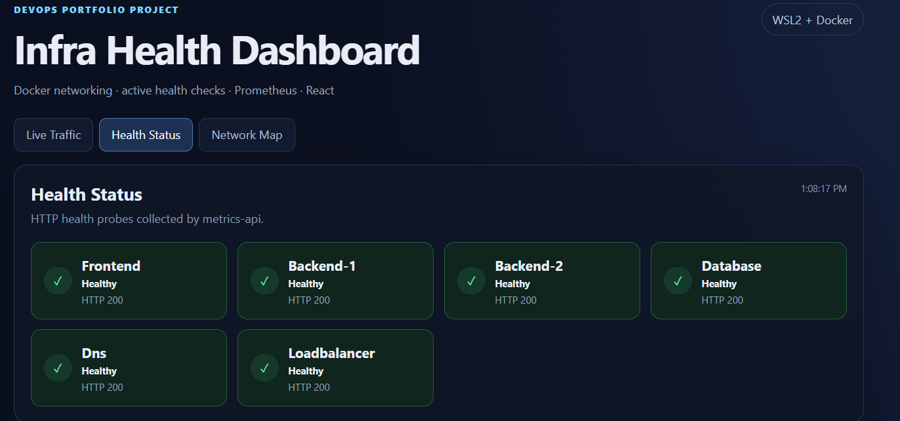

# Test 17 — Dashboard Health Status

## 1. What Is This Test?

This test verifies that the dashboard correctly displays the current health status of the infrastructure services.

The dashboard receives health information from the Metrics API and presents the status of each monitored service as an individual health card.

The monitored services are:

- Frontend
- Backend-1
- Backend-2
- Database
- Dns
- Loadbalancer

---

## 2. Why Does This Matter?

A monitoring dashboard should provide a quick and clear view of whether critical services are available.

Instead of manually checking each container, the dashboard provides a centralized view where an operator can immediately identify healthy or unhealthy components.

This test verifies that the health information collected by the monitoring layer is correctly displayed in the dashboard.

---

## 3. Test Objective

The objective is to verify that the **Health Status** section:

- Loads successfully.
- Displays all six monitored services.
- Shows the current status of each service.
- Displays healthy services as `Healthy`.
- Shows HTTP health-check status for each service.
- Correctly represents the current infrastructure state.

---

## 4. Test Environment

The test is performed locally using:

- Windows 11
- WSL2
- Docker Desktop
- Docker Engine
- Docker Compose
- React
- Metrics API
- Prometheus

Dashboard:

    http://localhost:3000

Health information source:

    Metrics API → /metrics/summary

---

## 5. Steps to Conduct the Test

Open the dashboard:

    http://localhost:3000

Select:

    Health Status

Wait for the dashboard to load the current health information.

Verify that all six monitored service cards are visible.

---

## 6. Expected Result

The dashboard should display all six monitored services in a healthy state:

    Frontend       → Healthy
    Backend-1      → Healthy
    Backend-2      → Healthy
    Database       → Healthy
    Dns            → Healthy
    Loadbalancer   → Healthy

Each healthy service should also show:

    HTTP 200

---

## 7. Test Evidence

The following screenshot shows the Infra Health Dashboard Health Status section with all six monitored services reporting healthy status.

---

## 8. Actual Test Output

The dashboard loaded successfully and displayed the **Health Status** section.

All six monitored services were visible and reported:

    Frontend       → Healthy → HTTP 200
    Backend-1      → Healthy → HTTP 200
    Backend-2      → Healthy → HTTP 200
    Database       → Healthy → HTTP 200
    Dns            → Healthy → HTTP 200
    Loadbalancer   → Healthy → HTTP 200

The dashboard also displayed a health-data timestamp:

    1:08:17 PM

at the time of the captured screenshot.

---

## 9. Output Explanation

### Frontend

The Frontend health card shows:

    Healthy
    HTTP 200

This indicates that the frontend health endpoint responded successfully.

---

### Backend-1

The Backend-1 health card shows:

    Healthy
    HTTP 200

This confirms that Backend 1 was available and responding successfully at the time of the test.

---

### Backend-2

The Backend-2 health card shows:

    Healthy
    HTTP 200

This confirms that Backend 2 was available and responding successfully.

---

### Database

The Database health card shows:

    Healthy
    HTTP 200

This indicates that the database service's health endpoint was responding successfully.

---

### Dns

The Dns health card shows:

    Healthy
    HTTP 200

This confirms that the DNS service health check was successful.

---

### Loadbalancer

The Loadbalancer health card shows:

    Healthy
    HTTP 200

This confirms that the NGINX load balancer health endpoint was responding successfully.

---

### Overall health state

All six monitored services are displayed with green health indicators and `Healthy` status.

The result is:

    Healthy services: 6
    Unhealthy services: 0

This demonstrates that the dashboard is successfully presenting the current health state of the monitored infrastructure.

---

## 10. Test Result

### PASS

The Dashboard Health Status test successfully passed.

The dashboard successfully displayed all six monitored services:

    Frontend
    Backend-1
    Backend-2
    Database
    Dns
    Loadbalancer

All six services reported:

    Healthy
    HTTP 200

This confirms that the dashboard is successfully receiving and displaying service health information from the monitoring system.
