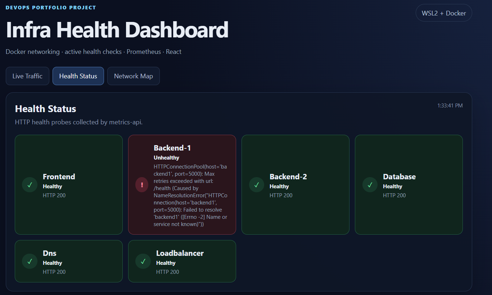
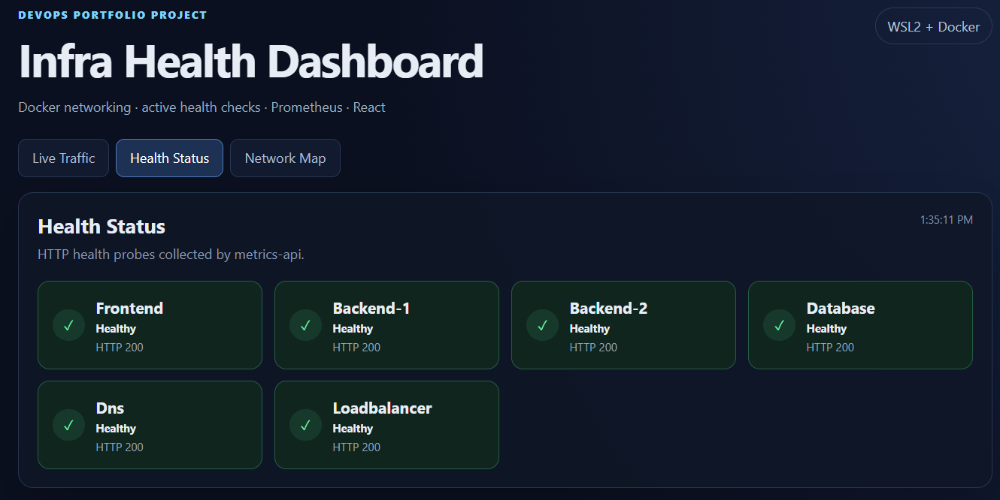

# Test 18 — Dashboard Failure Detection and Recovery

## 1. What Is This Test?

This test verifies that the dashboard can visually detect a backend failure and then reflect the backend's recovery.

Backend 1 is intentionally stopped and the dashboard's **Health Status** view is observed during the failure and after the service is started again.

The test sequence is:

    Backend 1 Healthy
          ↓
    Stop Backend 1
          ↓
    Dashboard detects failure
          ↓
    Backend 1 becomes Unhealthy
          ↓
    Start Backend 1
          ↓
    Dashboard detects recovery
          ↓
    Backend 1 becomes Healthy

---

## 2. Why Does This Matter?

A monitoring dashboard should not only display a healthy infrastructure state.

It should also reflect changes when a service becomes unavailable and when that service recovers.

This test verifies that the dashboard receives changing health information and updates the displayed service state accordingly.

---

## 3. Test Objective

The objective is to verify two states.

### Failure state

    Backend-1 → Unhealthy
    Other monitored services → Healthy

### Recovery state

    Backend-1 → Healthy
    Other monitored services → Healthy

The test therefore validates both failure detection and recovery visibility in the dashboard.

---

## 4. Test Environment

The test is performed locally using:

- Windows 11
- WSL2
- Docker Desktop
- Docker Engine
- Docker Compose
- React
- Metrics API
- Prometheus

Dashboard:

    http://localhost:3000

Health information source:

    Metrics API → /metrics/summary

---

## 5. Steps to Conduct the Test

### Step 1 — Open the dashboard

Open:

    http://localhost:3000

Select:

    Health Status

Confirm that Backend-1 is initially healthy.

---

### Step 2 — Stop Backend 1

Run:

    docker compose stop backend1

This intentionally creates the backend failure condition.

---

### Step 3 — Wait for the dashboard to detect the failure

Wait for the dashboard health polling to update.

Backend-1 should change from:

    Healthy

to:

    Unhealthy

---

### Step 4 — Capture the failure state

Capture the Health Status dashboard while Backend-1 is unhealthy.

---

### Step 5 — Restore Backend 1

Run:

    docker compose start backend1

Wait for the backend to become available again and for the dashboard health polling to update.

---

### Step 6 — Capture the recovery state

Capture the Health Status dashboard after Backend-1 returns to:

    Healthy
    HTTP 200

---

## 6. Expected Result

During the failure:

    Backend-1 → Unhealthy
    Frontend → Healthy
    Backend-2 → Healthy
    Database → Healthy
    Dns → Healthy
    Loadbalancer → Healthy

After recovery:

    Backend-1 → Healthy
    Frontend → Healthy
    Backend-2 → Healthy
    Database → Healthy
    Dns → Healthy
    Loadbalancer → Healthy

---

## 7. Test Evidence

The following screenshots show the dashboard during the Backend-1 failure and after Backend-1 recovered.

---

## 8. Actual Test Output

### Failure state

During the failure state, the dashboard displayed:

    Frontend       → Healthy → HTTP 200
    Backend-1      → Unhealthy
    Backend-2      → Healthy → HTTP 200
    Database       → Healthy → HTTP 200
    Dns            → Healthy → HTTP 200
    Loadbalancer   → Healthy → HTTP 200

Backend-1 displayed an error indicating that the health endpoint could not be reached because the `backend1` service was unavailable.

The visible error included:

    Name or service not known

This occurred because Backend 1 had been intentionally stopped.

---

### Recovery state

After Backend 1 was started again, the dashboard displayed:

    Frontend       → Healthy → HTTP 200
    Backend-1      → Healthy → HTTP 200
    Backend-2      → Healthy → HTTP 200
    Database       → Healthy → HTTP 200
    Dns            → Healthy → HTTP 200
    Loadbalancer   → Healthy → HTTP 200

The Backend-1 card returned to the normal green healthy state.

---

## 9. Output Explanation

### Backend-1 failure

The first screenshot shows Backend-1 in the red **Unhealthy** state while the other five monitored services remain healthy.

The dashboard also displays the connection error generated when the Metrics API attempts to reach the stopped Backend-1 health endpoint.

This confirms that the dashboard is reflecting the actual service failure rather than continuing to display Backend-1 as healthy.

---

### Other services during failure

While Backend-1 was unavailable, the following services remained healthy:

    Frontend
    Backend-2
    Database
    Dns
    Loadbalancer

Each displayed `Healthy` and `HTTP 200`.

This demonstrates that the dashboard distinguishes the failed backend from the other available services.

---

### Backend-1 recovery

The second screenshot shows Backend-1 returning to the green **Healthy** state with:

    HTTP 200

This confirms that the dashboard detected the recovery after the backend was started again.

---

### Complete health transition

The observed transition was:

    Backend-1
       ↓
    Healthy
       ↓
    Backend stopped
       ↓
    Unhealthy
       ↓
    Backend started
       ↓
    Healthy

This demonstrates that the dashboard can reflect both service failure and subsequent recovery.

---

## 10. Test Result

### PASS

The Dashboard Failure Detection and Recovery test successfully passed.

Backend-1 was intentionally stopped and the dashboard correctly changed its status to **Unhealthy** while the other monitored services remained healthy.

After Backend-1 was started again, the dashboard detected the recovery and displayed:

    Healthy
    HTTP 200

This confirms that the dashboard correctly reflects both backend failure and recovery states.
